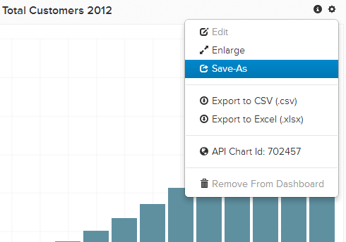

# Diagramm von einem anderen Benutzer importieren

Sie können auch ein Diagramm bearbeiten, das einem anderen Benutzer gehört, oder etwas Ähnliches erstellen. Es ist einfach, ein Diagramm zu importieren, dessen Besitzer ein anderer Benutzer ist, und es in Ihrem eigenen Dashboard zu speichern.

## Suchen des Diagramms

Suchen Sie zunächst das Diagramm, das Sie von dem anderen Benutzer kopieren möchten. Alle Dashboards, die für Sie freigegeben sind, finden Sie in der `Dashboard` Seitenleiste, wo sie mit dem Symbol Freigegeben gekennzeichnet sind. Klicken Sie auf das gewünschte Dashboard.

## Klonen des Diagramms

Wählen Sie im freigegebenen Dashboard das Diagramm aus, das Sie in Ihr eigenes Konto kopieren möchten. Klicken Sie auf das Zahnradsymbol  und dann auf **[!UICONTROL Save As]**.

Sie werden aufgefordert, Ihre Kopie des Diagramms zu benennen und sie einem Ihrer vorhandenen Dashboards hinzuzufügen. Wenn Sie kein Dashboard auswählen, wird es Ihrer Liste vorhandener Diagramme hinzugefügt und Sie können [es später hinzufügen](../../data-user/dashboards/add-charts-dashboard.md).

