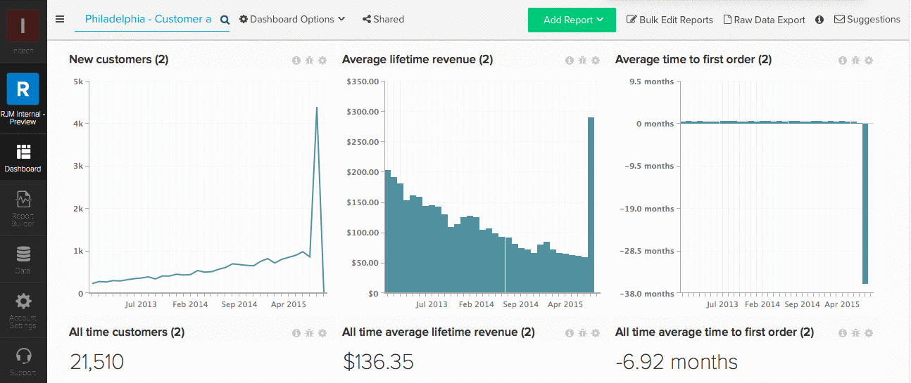

# Verlassen (Freigabe aufheben) eines Dashboards

Teams wechseln? In der Mitte des Frühlings reinigen Sie Ihre [!DNL MBI] Konto? Wenn Sie sich von einem Dashboard aus freigeben möchten, klicken Sie auf **[!UICONTROL Shared]** im oberen Bildschirmbereich des Dashboards, das Sie verlassen möchten. Klicken **[!UICONTROL Leave this Dashboard]** um sich selbst zu entfernen.

Beispiel:

