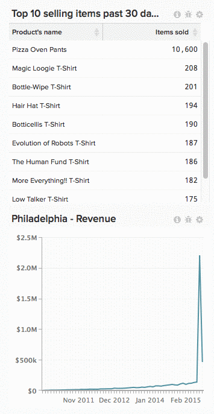

# Entfernen eines Diagramms aus einem Dashboard

Um ein Diagramm aus einem Dashboard zu entfernen, klicken Sie auf das Zahnradsymbol () in der oberen rechten Ecke des Diagramms und klicken Sie auf **[!UICONTROL Remove from Dashboard]**.

>[!NOTE]
>
>Das Entfernen eines Diagramms ist nicht dasselbe wie [Löschen](../../data-user/dashboards/delete-chart.md). Außerdem [kann ein Diagramm jederzeit in ein Dashboard ](../../data-user/dashboards/add-charts-dashboard.md) werden.

