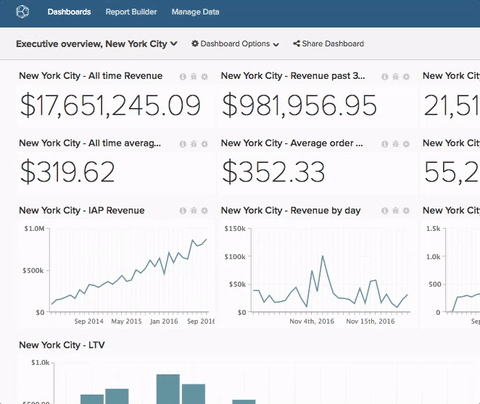

# Dashboard umbenennen

>[!NOTE]
>
>Erfordert [Admin](../../administrator/user-management/user-management.md) oder `Standard` Berechtigungen, um diese Funktionen auszuführen. Wenn Sie ein `Standard` Benutzer sind, benötigen Sie auch `Edit` Berechtigungen für das Dashboard.

Manchmal passen Namen einfach nicht mehr. Das Umbenennen eines Dashboards ist schnell und einfach.

1. Klicken Sie im Dashboard oben auf dem Bildschirm auf das **[!UICONTROL Dashboard Options]**-Menü neben dem `Global Search`.

1. Klicken Sie im Dropdown-Menü auf **[!UICONTROL Rename]** .

1. Geben Sie nach Aufforderung den neuen Namen für Ihr Dashboard ein.

1. Klicken Sie auf **[!UICONTROL Save Changes]**.

Beispiel:

