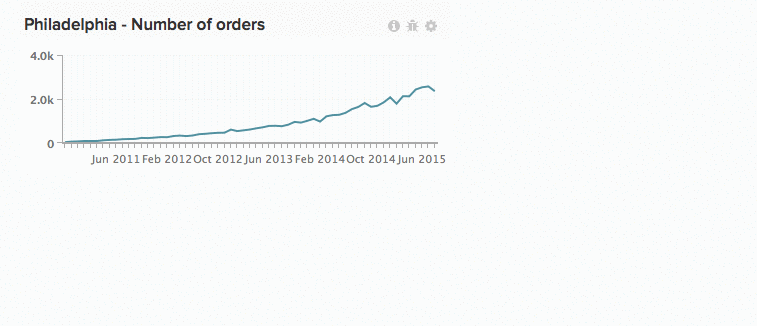
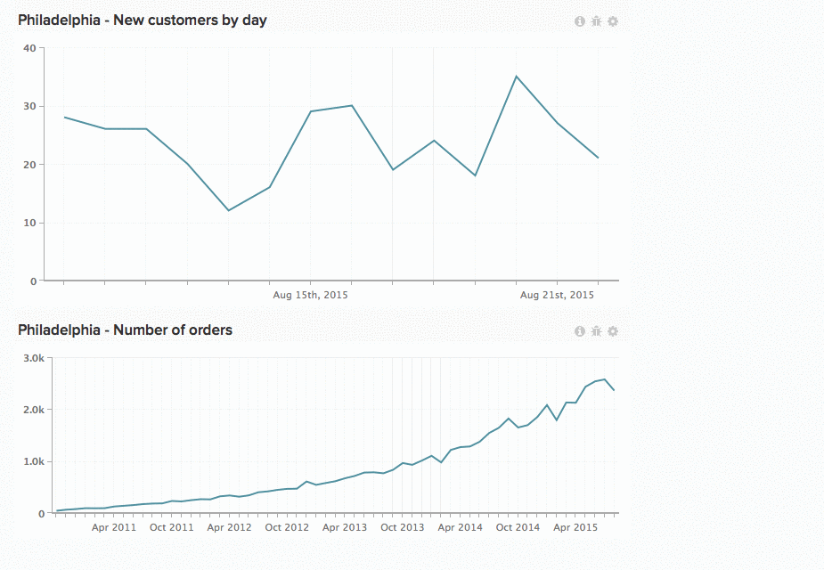

# Arbeiten mit Diagrammen in Dashboards

Skalare Zahlen. Balkendiagramme. Diagramme, die sich über lange Zeiträume erstrecken. Jedes Diagramm zeigt Informationen anders an, was bedeutet, dass die Größe und Position der Diagramme keine universelle Lösung ist. In [!DNL Commerce Intelligence] können Sie die Größe von Diagrammen ändern und sie neu anordnen, um Ihren idealen Arbeitsbereich zu erstellen.

*Um die Größe eines Diagramms* ändern, klicken und ziehen Sie die untere rechte Ecke eines beliebigen Diagramms.

*Um ein Diagramm zu verschieben* bewegen Sie den Mauszeiger über den oberen Rand des Diagramms, bis der `Move` angezeigt wird. Klicken und halten Sie und ziehen Sie das Diagramm dann an die gewünschte Position. Lassen Sie die Maustaste los, um das Diagramm zu platzieren.

