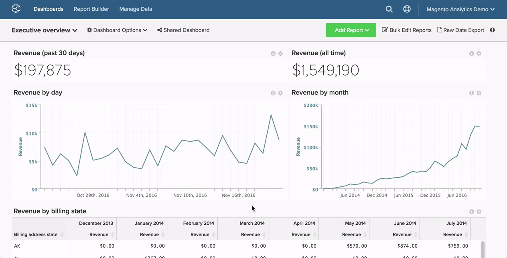
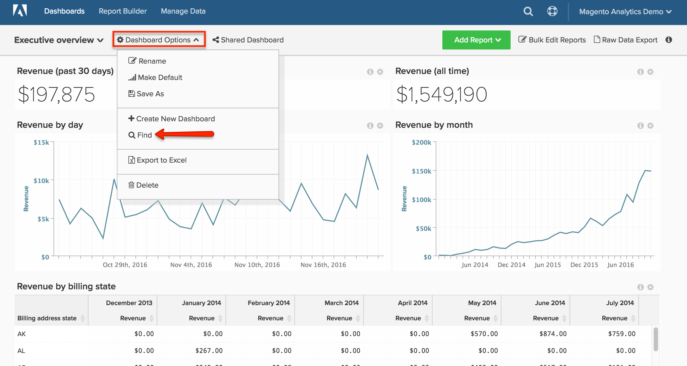

# Dashboard suchen

In diesem Thema erfahren Sie, wie Sie mit [[!DNL Global Search] Funktion](#global) nach Dashboards suchen und nach [Dashboards, die anderen Benutzern gehören](#other) suchen können.

## Globale Suche {#global}

Im [!DNL Global Search] Menü können Sie nach Dashboards suchen und diese auswählen, um sie anzuzeigen.

* *Um eine Liste Ihrer vorhandenen Dashboards anzuzeigen* klicken Sie auf das Dashboard.

* *Um nach einem Dashboard zu*, geben Sie einige Suchkriterien in die Suchleiste ein, nachdem Sie auf das Dropdown-Menü des Dashboards geklickt haben. Wenn Dashboards den Kriterien entsprechen, werden sie in der Liste zuerst angezeigt.

Beispiel:

## Suchen von Dashboards, die anderen Benutzern gehören {#other}

Suchen Sie nach einem Dashboard, das einem anderen Benutzer gehört? Wenn das Dashboard von anderen Benutzern angezeigt werden kann, können Sie danach suchen, indem Sie im Dropdown-Menü `Dashboard Options` auf **[!UICONTROL Find]** klicken.

