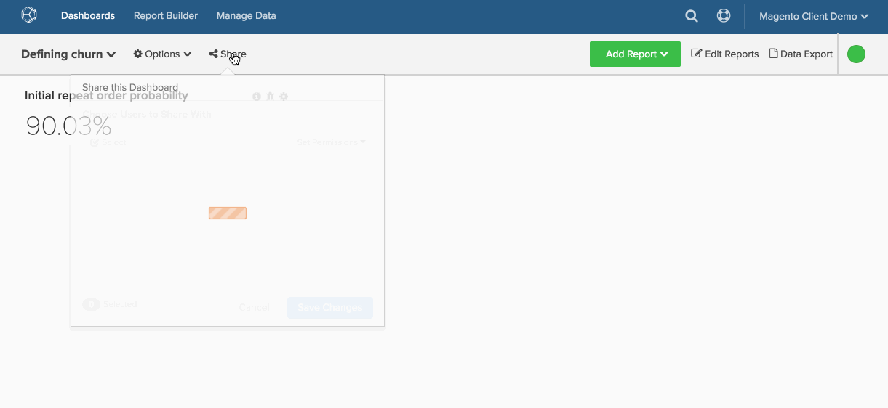

# Dashboards organisationsweit freigeben

Es ist einfach, sicherzustellen, dass alle Benutzenden Zugriff auf wichtige Unternehmens-Dashboards in [!DNL Adobe Commerce Intelligence] haben. Die universelle Dashboard-Freigabe ermöglicht eine bessere Zusammenarbeit und Transparenz in Ihrem gesamten Unternehmen, indem sie eine einzige „Quelle der Wahrheit“ bietet.

1. Um Ihren Mitarbeitern Ihre Einblicke anzuzeigen, klicken Sie oben im Bildschirm auf **[!UICONTROL Share this Dashboard]** .

1. Die Liste der Benutzer wird angezeigt. Der allererste Benutzer in der Liste ist Ihre Organisation. Aktivieren Sie das Kontrollkästchen neben dem Namen.

1. Legen Sie die `Permissions` fest, die andere Benutzer haben sollen - `View`, `Edit` oder `None`.

1. Klicken Sie auf **[!UICONTROL Save Changes]**.

   Wenn `Permissions` auf `View` oder `Edit` festgelegt wurden und Benutzer nach Ihrem Dashboard suchen, wird Ihr Dashboard in den Suchergebnissen angezeigt.

Beispiel:

<!--{: width="675" height="311"}-->
