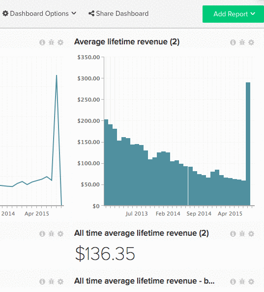

# Freigeben von Dashboards für andere Benutzer

Die Freigabe von Dashboards ist eine hervorragende Möglichkeit, Ihr Team auf dem Laufenden zu halten und gemeinsame Diskussionen zu fördern. Durch die Erstellung und Freigabe eines zentralen Dashboards können Sie Ihrem Team die benötigten Informationen bereitstellen und gleichzeitig die Kontrolle behalten. [[!DNL Adobe] empfiehlt](../../best-practices/share-dashboard-best-practice.md){: target="_blank"} einigen wenigen ausgewählten Benutzern `Edit` zu gewähren, um versehentliche Änderungen zu minimieren.

>[!NOTE]
>
>Wenn das Dashboard, das Sie freigeben, Berichte enthält, die mit Metriken erstellt wurden, auf die ein bestimmter Benutzer keinen Zugriff hat, zeigen die Berichte eine `Error Loading Data` an. Wenn die Daten dem jeweiligen Benutzer angezeigt werden sollen, muss ein [Admin-Benutzer](../../administrator/user-management/user-management.md) Zugriff auf alle in diesen Berichten verwendeten Metriken gewähren.

## Dashboard freigeben

1. Klicken Sie oben im Bildschirm auf **[!UICONTROL Share Dashboard]** .

   Eine Liste aller Benutzer in Ihrem [!DNL Commerce Intelligence]-Konto wird angezeigt.

1. Um einen Benutzer auszuwählen, für den das Dashboard freigegeben werden soll, aktivieren Sie das Kontrollkästchen links neben seinem Namen.

   Um alle Benutzer auszuwählen bzw. deren Auswahl aufzuheben, klicken Sie auf **[!UICONTROL Select]** und wählen Sie `Everyone` bzw. `None` aus.

1. Berechtigungen können benutzerspezifisch oder massenweise festgelegt werden.

   *Um individuelle Berechtigungen festzulegen* klicken Sie auf **[!UICONTROL None]** rechts neben dem Namen des Benutzers. Wählen Sie aus diesem Dropdown-Menü den Berechtigungstyp aus, den der Benutzer haben soll.

   *Um Berechtigungen massenweise festzulegen* klicken Sie auf **[!UICONTROL Set Permissions]**. Wählen Sie aus diesem Dropdown-Menü den Berechtigungstyp aus, den die ausgewählten Benutzer haben sollen.

   >[!NOTE]
   >
   >Sie können diese Funktion auch verwenden, um zuvor festgelegte Berechtigungen zu aktualisieren. Wenn Sie beispielsweise die Freigabe des Dashboards für eine andere Person beenden möchten, legen Sie deren Berechtigungen auf `None` fest.

1. Um das Dashboard freizugeben, klicken Sie auf **[!UICONTROL Save Changes]**. Der/die ausgewählte(n) Benutzer(n) erhält/erhalten eine E-Mail, in der er/sie aufgefordert wird/werden, das Dashboard anzuzeigen.

Beispiel:

