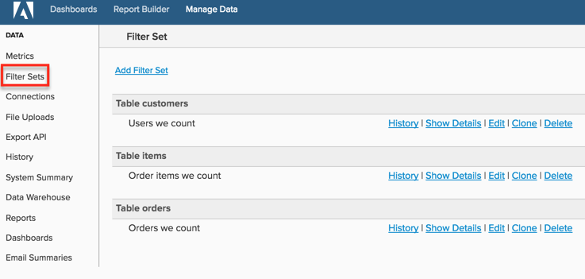

# Erstellen von Filtersätzen

Wenn Sie mehrere Metriken in [!DNL Commerce Intelligence] haben, die auf ähnliche Weise gefiltert werden müssen (z. B. Filtern von Testaufträgen), können Sie gespeicherte Filtersätze erstellen und sie auf die Metriken anwenden. Dies spart Ihnen Zeit, da Sie beim Erstellen oder Bearbeiten einer Metrik keine individuellen Filter hinzufügen müssen.

Weitere Informationen finden [ im ](https://experienceleague.adobe.com/docs/commerce-knowledge-base/kb/how-to/mbi-training-video-filter-sets.html?lang=de)Schulungsvideo“.

>[!NOTE]
>
>Erfordert [Administratorberechtigungen](../../administrator/user-management/user-management.md).

1. Klicken Sie in der Seitenleiste auf **[!DNL Manage Data** > **Filter Sets]** .

   

1. Klicken Sie oben auf der Seite auf **[!UICONTROL Add Filter Set]** .

1. Wählen Sie die Tabelle aus, die die Metriken enthält, die Sie filtern möchten.

   Wenn Sie beispielsweise Ihre `Total number of orders` filtern möchten und sie auf der `orders`-Tabelle aufbaut, wählen Sie diese Tabelle aus.

1. Benennen Sie die `Filter Set`.

1. Alle relevanten Filter hinzufügen.

   Wenn Sie beispielsweise nur Bestellungen mit dem Status „Abgeschlossen“ in Ihrer `Total number of orders` Metrik einbeziehen möchten, wenden Sie einen Filter an, der alle Bestellungen ausschließt, die keinen Status = `complete` haben.

1. Überprüfen Sie Ihre Filterlogik und stellen Sie sicher, dass Klammern und Operatoren korrekt platziert sind: z. B. `\[A\] AND \[B\]; (\[A\] OR \[B\]) AND \[C\]`.

   Ein falscher Filter ist oft die Ursache für Datendiskrepanzen zwischen [!DNL Commerce Intelligence] Berichten und den erwarteten Ergebnissen.

1. Speichern Sie die `Filter Set`.

Nachdem ein Filtersatz gespeichert wurde, können Sie ihn auf jede Metrik anwenden, die dieselbe Tabelle verwendet. Wenn Sie beispielsweise ein `Filter Set` in der `orders`-Tabelle erstellt haben, können Sie es auf *beliebige Metriken) anwenden,* auf dieser Tabelle erstellt wurden, z. B. `Revenue`.

>[!NOTE]
>
>`Filter Sets` können auch auf berechnete Spalten in [!DNL Commerce Intelligence] angewendet werden. Sie können über einen Filtersatz auf eine in [!DNL Commerce Intelligence] erstellte Datendimension anwenden, indem Sie sich an den Support wenden.

## verwandt

* [Best Practices für Segmentierung und Filterung](../../best-practices/segment-filter.md)
