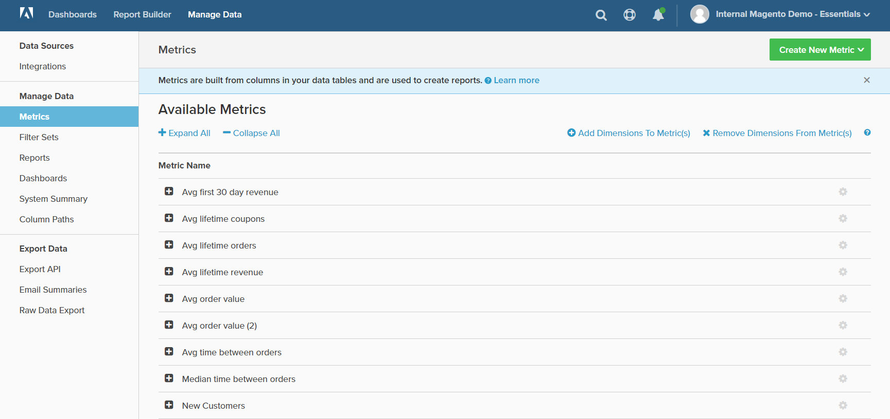

# Verwalten von Daten

Daten verwalten bietet Zugriff auf verschiedene Tools zum Verwalten von Integrationen, Berichts- und Diagrammdaten, Dashboards und Exporten.

## So greifen Sie auf [!DNL Manage Data] zu:

1. Klicken Sie im Menü auf **[!DNL Manage Data]**.

1. Wählen Sie in der Seitenleiste das gewünschte Thema unter den folgenden Überschriften aus:

   * `Data Sources`
   * `Manage Data`
   * `Export Data`

   <!--{: .zoom}-->
