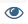

# Filter

Es können ein oder mehrere Filter hinzugefügt werden, um die Daten zu begrenzen, die für das Erstellen eines Berichts verwendet werden. Jeder Filter ist ein Ausdruck, der eine Spalte aus der zugehörigen Tabelle, einen Operator und einen Wert enthält. Um beispielsweise nur Bestandskunden einzubeziehen, können Sie einen Filter erstellen, der nur Kunden enthält, die mehr als eine Bestellung aufgegeben haben. Mit logischen `AND/OR`-Operatoren können mehrere Filter verwendet werden, um dem Bericht Logik hinzuzufügen.

>[!TIP]
>
>Ein Bericht kann maximal 3.500 Datenpunkte enthalten. Um die Anzahl der Datenpunkte zu reduzieren, verwenden Sie einen Filter, um die Datenmenge zu reduzieren, die zum Generieren des Berichts verwendet wird.

[!DNL Adobe Commerce Intelligence] enthält eine Auswahl von Filtern, die Sie „vorkonfiguriert“ (OOTB) verwenden oder an Ihre Anforderungen anpassen können. Die Anzahl der Filter, die Sie erstellen können, ist unbegrenzt.

## So fügen Sie einen Filter hinzu:

1. Bewegen Sie im Diagramm den Mauszeiger über die einzelnen Datenpunkte.

   In diesem Bericht zeigt jeder Datenpunkt die Gesamtzahl der Kunden für den Monat an.

1. Klicken Sie im linken Bedienfeld auf das Symbol „Filter).

   

1. Klicken Sie auf **[!UICONTROL Add Filter]**.

   Filter sind alphabetisch nummeriert, wobei der erste `[A]` ist. Die ersten beiden Teile des Filters sind Dropdown-Optionen, und der dritte Teil ist ein -Wert.

   

   * Klicken Sie auf den ersten Teil des Filters und wählen Sie die Spalte aus, die Sie als Betreff des Ausdrucks verwenden möchten.

     

   * Klicken Sie auf den zweiten Teil des Filters und wählen Sie den Operator aus.

     

   * Geben Sie im dritten Teil des Filters den Wert ein, der zum Vervollständigen des Ausdrucks erforderlich ist.

     

   * Wenn der Filter abgeschlossen ist, klicken Sie auf **[!UICONTROL Apply]**.

     Der Bericht enthält jetzt nur noch Bestandskunden, und die Anzahl der für den Bericht abgerufenen Kundendatensätze wurde von 33.000 auf 12.600 reduziert.

     <!--{: .zoom}-->

1. Klicken Sie in der Seitenleiste auf das Symbol für die ).

   <!--{: .zoom}-->

1. Wählen Sie in der Liste der Einstellungen `Cumulative` aus. Klicken Sie dann auf **[!UICONTROL Apply]**.

   

   Die `Cumulative` Perspektive verteilt die Änderung über die Zeit, anstatt die gezackten Auf- und Abwärtsbewegungen für jeden Monat anzuzeigen.

1. Geben Sie einen `Title` für den Bericht ein und klicken Sie **[!UICONTROL Save]** ihn als `Chart` auf Ihr Dashboard.

   
