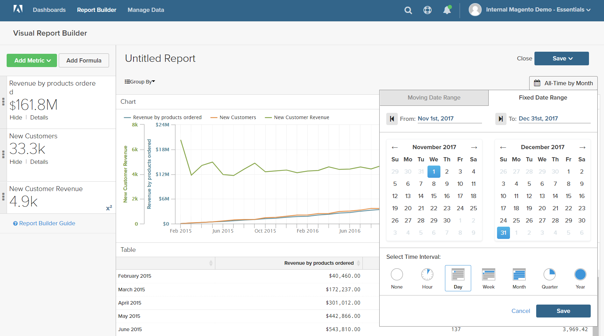
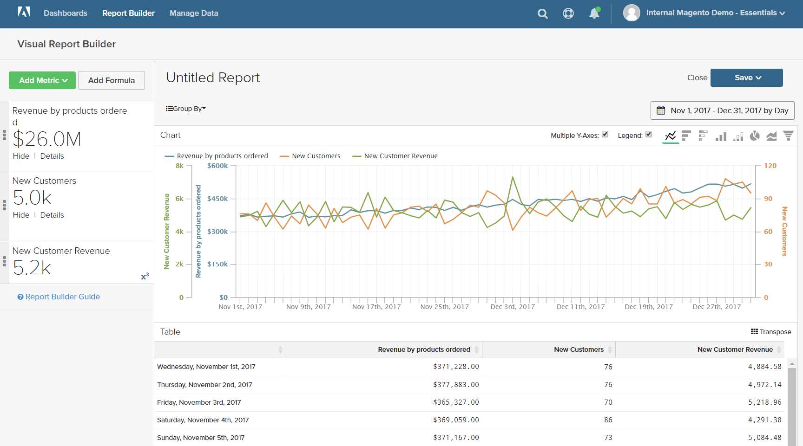

# Formeln

Eine Formel kombiniert mehrere Metriken und mathematische Logik, um eine Frage zu beantworten. Wie viel vom Umsatz pro Produkt während der Weihnachtszeit wurde beispielsweise von neuen Kunden generiert?

## Schritt 1: Basisbericht erstellen

1. Wählen Sie im Menü `Report Builder`.

1. Klicken **[!UICONTROL Add Metric]** und wählen Sie die erste Metrik für den Bericht aus.

   In diesem Beispiel wird die Variable `Revenue by products ordered` verwendet.

1. Klicken **[!UICONTROL Add Metric]** erneut und wählen Sie die zweite Metrik für den Bericht aus.

   In diesem Beispiel wird die Variable `New Customers` verwendet.

1. Klicken Sie in der Seitenleiste auf **[!UICONTROL Details]** , um Informationen zu den einzelnen Metriken anzuzeigen.

   

1. Klicken Sie in der Seitenleiste auf den Namen jeder Metrik, um die Einstellungsseite in einer neuen Browser-Registerkarte zu öffnen. Scrollen Sie nach unten, um die einzelnen Komponenten der Metrik anzuzeigen, einschließlich der Metrikabfrage, des Filters und der Dimensionen.

   

1. Um zu Ihrem Bericht zurückzukehren, klicken Sie auf die Registerkarte &quot;Vorheriger Browser&quot;.

1. Bewegen Sie im Diagramm den Mauszeiger über einige Datenpunkte in jeder Zeile, um die mit den einzelnen Metriken verbundenen Beträge anzuzeigen.

## Schritt 2: Hinzufügen einer Formel

1. Klicken Sie oben in der Seitenleiste auf **[!UICONTROL Add Formula]**.

   Das Formelfeld zeigt die Metriken als verfügbare Eingaben an `A` und `B`und enthält ein Eingabefeld, in das Sie die Formel eingeben können.

   Gehen Sie wie folgt vor:

   * Im `Enter your Formula` Eingabefeld, Eingabe `A/B`.

      Dadurch wird der Umsatz durch die bestellten Produkte durch die Anzahl neuer Kunden dividiert.

   * Satz `Select format` nach `123Number`.

   * Ersetzen Sie in der Seitenleiste `Untitled` mit einem Namen für die Formel.

   

1. Wenn Sie fertig sind, klicken Sie auf **[!UICONTROL Apply]**.

   Der Bericht enthält nun eine neue Zeile für die Formel, `New Customer Revenue`und die Seitenleiste zeigt die Gesamtsumme des Umsatzes an, der von neuen Kunden generiert wurde.

   

## Schritt 3: Datumsbereich hinzufügen

1. Klicken **[!UICONTROL Date Range]** in der oberen rechten Ecke.

1. Im `Fixed Date Range` Gehen Sie wie folgt vor:

   * Wählen Sie in den Kalendern den Datumsbereich aus.

      In diesem Beispiel stammt die Weihnachtszeit von `November 1` bis `December 31`.

   * under `Select Time Interval`auswählen `Day`.

      

   * Wenn Sie fertig sind, klicken Sie auf **[!UICONTROL Apply]**.

   Der Bericht ist nun auf die Weihnachtszeit beschränkt und enthält für jeden Tag einen Datenpunkt.

   

## Schritt 4: Bericht speichern

In diesem Schritt speichern Sie den Bericht als Grafik und auch als Tabelle.

1. Klicken `Untitled Report` oben auf der Seite und geben Sie einen beschreibenden Titel ein. In diesem Beispiel lautet der Berichtstitel `2017 Holiday Sales`.

   Führen Sie dann die folgenden Schritte aus:

   * Klicken Sie oben rechts auf **[!UICONTROL Save]**.

   * Für `Type`, übernehmen Sie die Standardeinstellung `Chart` -Einstellung.

   * Wählen Sie die `Dashboard` wo der Bericht verfügbar sein soll.

   * Klicken **[!UICONTROL Save to Dashboard]**.

1. Klicken Sie auf den Berichtstitel und ändern Sie den Namen. In diesem Beispiel ändert sich der Berichtstitel in `2017 Holiday Sales Data`.

   Führen Sie dann die folgenden Schritte aus:

   * Klicken Sie oben rechts auf **[!UICONTROL Save a Copy]**.

   * Satz `Type` nach `Table`.

   * Wählen Sie die `Dashboard` wo der Bericht verfügbar sein soll.

   * Klicken **[!UICONTROL Save a Copy to Dashboard]**.

1. Führen Sie einen der folgenden Schritte aus, um die Berichte in Ihrem Dashboard anzuzeigen:

   * Klicken **[!UICONTROL Go to Dashboard]** in der Nachricht oben auf der Seite.

   * Wählen Sie im Menü **[!UICONTROL Dashboards]**. Klicken Sie auf den Namen des aktuellen Dashboards, um die Liste anzuzeigen. Klicken Sie dann auf den Namen des Dashboards, in dem der Bericht gespeichert wurde.
