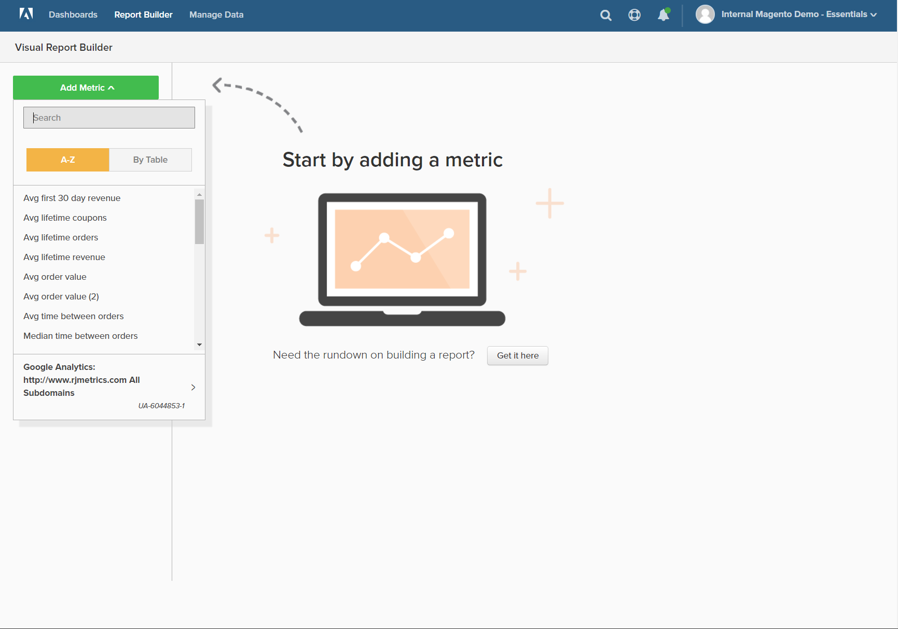

# `Visual Report Builder`

`Visual Report Builder` erleichtert die Erstellung von Schnellberichten auf der Grundlage vordefinierter Metriken. Jede Metrik enthält eine Abfrage, die den Datensatz für den Bericht definiert.

Das folgende Beispiel zeigt, wie Sie einen einfachen Bericht erstellen, die Daten nach einer zusätzlichen Dimension gruppieren, das Datums- und Uhrzeitintervall festlegen, den Diagrammtyp ändern und den Bericht in einem Dashboard speichern.

## So erstellen Sie einen einfachen Bericht:

1. Im [!DNL MBI] Menü, klicken Sie **[!UICONTROL Report Builder]**.

1. under `Visual Report Builder`klicken **[!UICONTROL Create Report]** und gehen Sie wie folgt vor:

   * Klicken **[!UICONTROL Add Metric]**.

      Die verfügbaren Metriken können alphabetisch oder nach Tabelle aufgelistet werden.

      

   * Wählen Sie die [Metrik](../../data-user/reports/ess-manage-data-metrics.md) beschreibt den Datensatz, den Sie für den Bericht verwenden möchten.

      Die `New Customers` -Metrik, die in diesem Beispiel verwendet wird, zählt alle Kunden und sortiert die Liste nach dem Datum, an dem sich der Kunde für ein Konto angemeldet hat. Der erste Bericht enthält ein einfaches Liniendiagramm, gefolgt von der Datentabelle.

      Die Zusammenfassung auf der linken Seite zeigt den Namen der aktuellen Metrik, gefolgt vom Ergebnis aller Berechnungen zu Spaltendaten, die in der Metrik angegeben sind. In diesem Beispiel zeigt die Zusammenfassung die Gesamtanzahl der Kunden an.

      

1. Bewegen Sie im Diagramm den Mauszeiger über jeden Datenpunkt auf der Zeile. Jeder Datenpunkt zeigt die Gesamtzahl neuer Kunden an, die sich während dieses Monats angemeldet haben.

1. Befolgen Sie diese Anweisungen, um die Daten zu gruppieren, den Datumsbereich und den Diagrammtyp zu ändern.

   **`Group By`**

   Die `Group By` -Kontrolle bietet Ihnen die Möglichkeit, mehrere Dimensionen nach Gruppe oder Segment hinzuzufügen. Dimensionen sind Tabellenspalten, die zur Gruppierung der Daten verwendet werden können.

   * Wählen Sie eine der verfügbaren Dimensionen aus der Liste der `Group By` Optionen.

      In diesem Beispiel hat das System fünf Coupon-Codes gefunden, die von Kunden bei der ersten Bestellung verwendet wurden.

      

      Die `Group By` detail listet jeden von Kunden verwendeten Gutschein auf. Die Gutscheine, die zum Platzieren der ursprünglichen Bestellung verwendet wurden, sind mit einem Kontrollkästchen markiert. Das Diagramm enthält jetzt mehrere farbige Linien, die den jeweiligen Gutschein darstellen, der für eine erste Bestellung verwendet wurde. Die Legende ist farbcodiert und entspricht jeder Datenzeile.

   * Klicken **[!UICONTROL Apply]** um die Gruppe nach Detail zu schließen.

      

   * Bewegen Sie den Mauszeiger über einige Datenpunkte in jeder Zeile, um die Anzahl der Kunden während des Monats anzuzeigen, die diesen Coupon bei der ersten Bestellung verwendet haben.

   * Die Datentabelle verfügt jetzt über eine Hinzufüge -Dimension mit einer Spalte für jeden Monat und einer Zeile für jeden Couponcode.

      

   * Klicken Sie auf Transponieren () in der rechten oberen Ecke der Tabelle, um die Ausrichtung der Daten zu ändern.

      Die Datenachse wird gespiegelt, und die Tabelle enthält jetzt eine Spalte für jeden Couponcode und eine Zeile für jeden Monat. Vielleicht ist diese Ausrichtung leichter zu lesen.

      
   **`Date Range`**

   Die `Date Range` Die Kontrolle zeigt den aktuellen Datumsbereich und die Zeitintervalleinstellungen an und befindet sich direkt über dem Diagramm auf der rechten Seite.

   * Klicken Sie auf `Date Range` -Steuerelement, das in diesem Beispiel auf `All-Time by Month`.

      

   * Nehmen Sie die folgenden Änderungen vor:

      * Um für eine genauere Ansicht einzoomen, ändern Sie den Datumsbereich in `Last Full Quarter`.
      * under `Select Time Interval`auswählen `Week`.
      * Wenn Sie fertig sind, klicken Sie auf **[!UICONTROL Save]**.

      Der Bericht enthält jetzt nur die Daten des letzten Quartals nach Woche.

      
   **Diagrammtyp**

   * Klicken Sie auf die Steuerelemente in der oberen rechten Ecke, um das beste Diagramm für die Daten zu finden.

      Einige Diagrammtypen sind nicht mit multidimensionalen Daten kompatibel.

      |  |  |
      |-----|-----|
      |  | Kantengraph |
      |  | Horizontalbalken |
      |  | Horizontaler gestapelter Balken |
      |  | Vertikalbalken |
      |  | Vertikaler gestapelter Balken |
      |  | Torte |
      |  | Bereich |
      |  | Trichter |

      {style=&quot;table-layout:auto&quot;}

1. So geben Sie dem Bericht einen `title`, ersetzen Sie die `Untitled Report` Text oben auf der Seite mit einem beschreibenden Titel.

1. Klicken Sie oben rechts auf **[!UICONTROL Save]** und gehen Sie wie folgt vor:

   * Für `Type`, die Standardeinstellung akzeptieren, `Chart`.

   * Wählen Sie die `Dashboard` wo der Bericht verfügbar sein soll.

   * Klicken **[!UICONTROL Save to Dashboard]**.

      

1. Führen Sie einen der folgenden Schritte aus, um die Grafik in einem Dashboard anzuzeigen:

   * Klicken **[!UICONTROL Go to Dashboard]** in der Nachricht oben auf der Seite.

   * Wählen Sie im Menü `Dashboards` und klicken Sie auf den Namen des aktuellen Dashboards, um die Liste anzuzeigen. Klicken Sie dann auf den Namen des Dashboards, in dem der Bericht gespeichert wurde.

      
