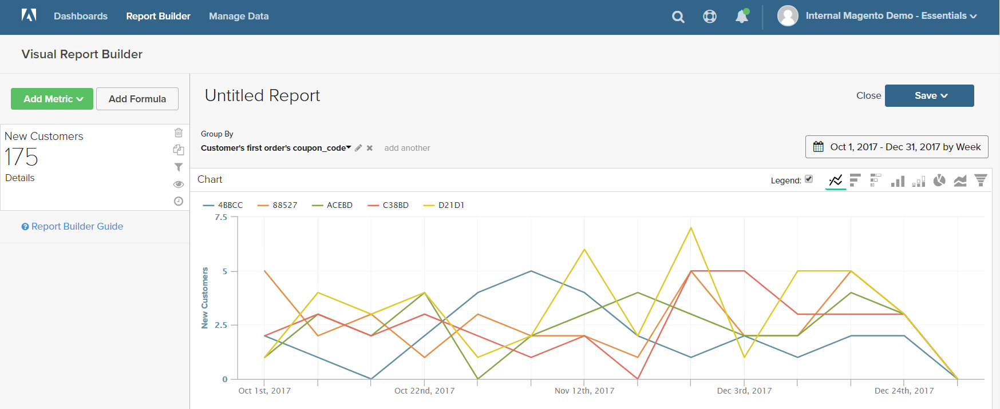

# [!DNL Visual Report Builder]

[!DNL Visual Report Builder] ist es einfach, schnelle Berichte auf der Grundlage vordefinierter Metriken zu erstellen. Jede Metrik enthält eine Abfrage, die den Datensatz für den Bericht definiert.

Das folgende Beispiel zeigt, wie Sie einen einfachen Bericht erstellen, die Daten nach einer zusätzlichen Dimension gruppieren, das Datum und das Zeitintervall festlegen, den Diagrammtyp ändern und den Bericht in einem Dashboard speichern.

## So erstellen Sie einen einfachen Bericht:

1. Klicken Sie im Menü [!DNL Commerce Intelligence] auf **[!UICONTROL Report Builder]**.

1. Klicken Sie unter [!UICONTROL Visual Report Builder] auf **[!UICONTROL Create Report]** und führen Sie folgende Schritte aus:

   * Klicken Sie auf **[!UICONTROL Add Metric]**.

     Die verfügbaren Metriken können alphabetisch oder nach Tabelle aufgelistet werden.

     

   * Wählen Sie die [Metrik](../../data-user/reports/ess-manage-data-metrics.md), die den Datensatz beschreibt, den Sie für den Bericht verwenden möchten.

     Die in diesem Beispiel verwendete `New Customers`-Metrik zählt alle Kunden und sortiert die Liste nach dem Datum, an dem sich der Kunde für ein Konto angemeldet hat. Der erste Bericht enthält ein einfaches Liniendiagramm, gefolgt von der Datentabelle.

     Die Zusammenfassung auf der linken Seite zeigt den Namen der aktuellen Metrik an, gefolgt vom Ergebnis aller Berechnungen mit Spaltendaten, die in der Metrik angegeben sind. In diesem Beispiel zeigt die Zusammenfassung die Gesamtkundenanzahl an.

     

1. Bewegen Sie im Diagramm den Mauszeiger über die einzelnen Datenpunkte auf der Linie. Jeder Datenpunkt zeigt die Gesamtzahl der neuen Kundinnen und Kunden an, die sich in diesem Monat angemeldet haben.

1. Folgen Sie diesen Anweisungen, um die Daten zu gruppieren, den Datumsbereich und den Diagrammtyp zu ändern.

   **`Group By`**

   Mit dem `Group By` können Sie mehrere Dimensionen nach Gruppe oder Segment hinzufügen. Dimensionen sind Spalten in der Tabelle, die zur Gruppierung der Daten verwendet werden können.

   * Wählen Sie eine der verfügbaren Dimensionen aus der Liste `Group By` Optionen aus.

     In diesem Beispiel hat das System fünf Gutscheincodes gefunden, die von Kunden bei der ersten Bestellung verwendet wurden.

     

     Im `Group By` sind alle von Kunden verwendeten Coupons aufgeführt. Die Coupons, die für die ursprüngliche Bestellung verwendet wurden, sind mit einem Kontrollkästchen markiert. Das Diagramm enthält jetzt mehrere farbige Linien, die jeden Coupon darstellen, der für eine erste Bestellung verwendet wurde. Die Legende ist farbcodiert, um jeder Datenzeile zu entsprechen.

   * Klicken Sie auf **[!UICONTROL Apply]** , um das Fenster Nach Detail gruppieren zu schließen.

     

   * Bewegen Sie den Mauszeiger über einige Datenpunkte in jeder Zeile, um die Anzahl der Kunden während des Monats anzuzeigen, die diesen Coupon bei der ersten Bestellung verwendet haben.

   * Die Datentabelle hat jetzt eine zusätzliche Dimension mit einer Spalte für jeden Monat und einer Zeile für jeden Couponcode.

     

   * Klicken Sie auf das Steuerelement  in der oberen rechten Ecke der Tabelle, um die Ausrichtung der Daten zu ändern.

     Die Achse der Daten wird umgekehrt, und die Tabelle hat jetzt eine Spalte für jeden Couponcode und eine Zeile für jeden Monat. Diese Ausrichtung ist möglicherweise leichter zu lesen.

     

   **`Date Range`**

   Das `Date Range` Steuerelement zeigt die aktuellen Einstellungen für Datumsbereich und Zeitintervall an und befindet sich direkt über dem Diagramm rechts.

   * Klicken Sie auf das `Date Range`, das in diesem Beispiel auf `All-Time by Month` festgelegt ist.

     

   * Nehmen Sie die folgenden Änderungen vor:

      * Um näher heranzuzoomen, ändern Sie den Datumsbereich in `Last Full Quarter`.
      * Wählen Sie unter `Select Time Interval` die Option `Week` aus.
      * Klicken Sie abschließend auf **[!UICONTROL Save]**.

     Der Bericht enthält jetzt nur noch die Daten für das letzte Quartal, aufgeschlüsselt nach Woche.

     

   **Diagrammtyp**

   * Klicken Sie auf die Steuerelemente oben rechts, um das beste Diagramm für die Daten zu finden.

     Einige Diagrammtypen sind nicht mit mehrdimensionalen Daten kompatibel.

     | | |
     |-----|-----|
     |  | Liniendiagramm |
     |  | Horizontalbalken |
     |  | Horizontaler gestapelter Balken |
     |  | Vertikaler Balken |
     |  | Vertikaler gestapelter Balken |
     |  | Kreis |
     |  | Bereich |
     |  | Trichter |

     {style="table-layout:auto"}

1. Um dem Bericht eine `title` zu geben, ersetzen Sie den `Untitled Report` oben auf der Seite durch einen beschreibenden Titel.

1. Klicken Sie oben rechts auf **[!UICONTROL Save]** und führen Sie folgende Schritte aus:

   * Akzeptieren Sie `Type` die Standardeinstellung `Chart`.

   * Wählen Sie die `Dashboard` aus, in der der Bericht verfügbar sein soll.

   * Klicken Sie auf **[!UICONTROL Save to Dashboard]**.

     

1. Führen Sie einen der folgenden Schritte aus, um das Diagramm in einem Dashboard anzuzeigen:

   * Klicken Sie oben auf der Seite in der Nachricht auf **[!UICONTROL Go to Dashboard]** .

   * Wählen Sie im Menü die Option `Dashboards` und klicken Sie auf den Namen des aktuellen Dashboards, um die Liste anzuzeigen. Klicken Sie anschließend auf den Namen des Dashboards, in dem der Bericht gespeichert wurde.

     
