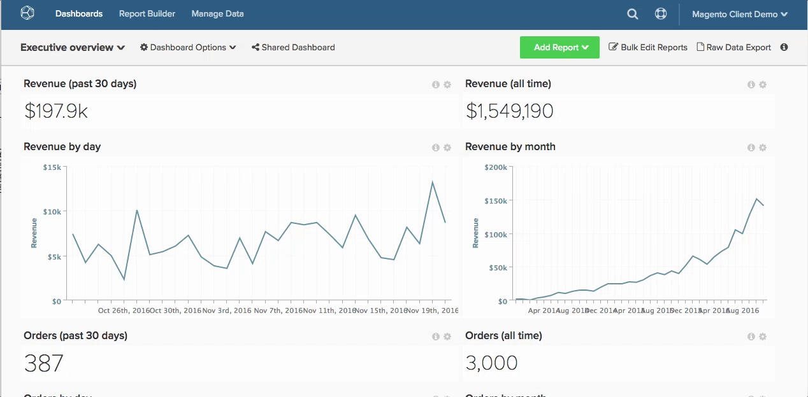

# Verwenden eines Berichts

Verwenden von Berichten in [!DNL MBI] um Ihnen bei der Beantwortung von Geschäftsfragen zu helfen - ob Sie einfach den Umsatz dieses Monats im Vergleich zum letzten Jahr sehen oder Ihre Akquisekosten für Ihre neuesten [!DNL Google AdWords] Kampagne.

Wie sieht der Weg von Frage zu Antwort genau aus?

Um Ihnen bei der Visualisierung dieses Prozesses zu helfen, haben wir diese Route unten zugeordnet. Dieses Thema wird Ihnen Aufschluss darüber geben, wie wir eine analytische Frage angehen, und wie die Backend-Logistik, die erforderlich ist, um Ihnen die benötigten Daten zu liefern.

## Beginnen mit der Frage

Wir wissen, dass Sie ständig Fragen stellen, um Ihr Geschäft zu verbessern, von der Steigerung der Kundenzufriedenheit bis zur Senkung der Lieferkosten. Wir werden uns darauf konzentrieren, Ihre Fragen in Analysen zu übersetzen, die Ihnen helfen, Entscheidungen zu treffen.

Für unser Beispiel gehen wir davon aus, dass wir die folgende Frage beantworten möchten:

* Wie schnell konvertieren meine neuen Registrierungspflichtigen?

## Kennzeichnen einer Messung

Mit unserer Frage in der Hand ist es an der Zeit, eine Liste möglicher Analysen und Messungen zu ermitteln, um die Frage zu beantworten. In diesem Beispiel konzentrieren Sie sich auf die folgende Metrik:

* Durchschnittliche Zeit von der Registrierung bis zum ersten Kaufdatum pro Verwendung.

Dies zeigt die durchschnittliche Zeit, die zwischen dem Registrierungsdatum und dem ersten Kaufdatum des Benutzers vergeht, und gibt eine Vorstellung davon, wie sich Benutzer bei diesem letzten Schritt im Konversionstrichter verhalten.

## Daten suchen

Das Verständnis, was gemessen werden soll, bringt uns nur in den Weg dorthin. Um die durchschnittliche Zeit von der Registrierung bis zum ersten Kaufdatum pro Benutzer zu bewerten, müssen wir alle Datenpunkte identifizieren, aus denen unsere Kennzahl besteht.

Schlüsseln Sie unsere Kennzahl in ihre Kernkomponenten auf: wir müssen wissen, wie viele Personen registriert sind oder wie viele Personen registriert sind. Anzahl der Personen, die einen Kauf getätigt haben; und der Zeit, die zwischen diesen beiden Ereignissen verstrichen ist.

Auf höherer Ebene müssen wir wissen, wo diese Daten in der Datenbank zu finden sind, insbesondere:

* Die Tabelle, die bei jeder Registrierung eine Datenzeile aufzeichnet
* Die Tabelle, die bei jedem Kauf eine Datenzeile aufzeichnet
* Die Spalte, die verwendet werden kann, um der `purchase` -Tabelle `customer` table - so können wir wissen, wer einen Kauf getätigt hat

Auf einer detaillierteren Ebene müssen wir die genauen Datenfelder identifizieren, die für diese Analyse verwendet werden:

* Die Datentabelle und -spalte, die das Registrierungsdatum eines Kunden enthalten: Beispiel `user.created\_at`
* Die Datentabelle und -spalte, die ein Kaufdatum enthalten: Beispiel `order.created\_at`

## Datenspalten für Analysen erstellen

Zusätzlich zu den oben beschriebenen nativen Datenspalten benötigen wir auch eine Reihe berechneter Datenfelder, um diese Analyse zu ermöglichen, darunter:

* `Customer's first purchase date` , der die `MIN(order.created_at`)

Damit wird Folgendes erstellt:

* `Time between a customer's registration date and first purchase date`, der die Zeit eines bestimmten Benutzers zwischen der Registrierung und dem ersten Kaufdatum zurückgibt. Dies wird später die Grundlage für unsere Metrik sein.

Beide Felder müssen auf Benutzerebene erstellt werden (z. B. auf der `user` -Tabelle), sodass die durchschnittliche Analyse von den Benutzern normalisiert werden kann (d. h. der Nenner in dieser durchschnittlichen Berechnung ist die Anzahl der Benutzer).

Hier [!DNL MBI] Schritte ein! Sie können Ihre [!DNL MBI] Data Warehouse verwendet, um die oben genannten Spalten zu erstellen. Wenden Sie sich einfach an unser Analyseteam und geben Sie uns die genaue Definition Ihrer neuen Spalten an, und wir werden sie erstellen. Sie können auch unsere [Spalteneditor](../../data-analyst/data-warehouse-mgr/creating-calculated-columns.md).

Es empfiehlt sich, diese berechneten Datenfelder nicht direkt in Ihrer Datenbank zu erstellen, da dies Ihre Produktionsserver unnötig belastet.

## Erstellen der Metrik

Da wir nun über die erforderlichen Datenfelder für unsere Analyse verfügen, ist es an der Zeit, die relevante Metrik zu finden oder zu erstellen, um unsere Analyse zu erstellen.

Hier wissen wir, dass wir mathematisch die folgende Berechnung durchführen möchten:

_[SUM von `Time between a customer's registration date and first purchase date`] / [Gesamtzahl der Kunden, die sich registriert und gekauft haben]_

Und wir möchten diese Berechnung über einen Zeitraum oder Trend nach dem Registrierungsdatum eines Kunden zeichnen. Und hier sehen Sie, wie Sie [diese Metrik erstellen](../../data-user/reports/ess-manage-data-metrics.md) in [!DNL MBI]:

1. Navigieren Sie zu **[!UICONTROL Data]** und wählen Sie die `Metrics` Registerkarte.
1. Klicken **[!UICONTROL Add New Metric]** und wählen Sie die `user` -Tabelle (wo wir die oben genannten Dimensionen erstellt haben).
1. Wählen Sie aus der Dropdown-Liste `Average` auf`Time between a customer's registration date and first purchase date` in der Spalte `user` nach der `Customer's registration date`  Spalte.
1. Fügen Sie alle relevanten Filter oder Filtersätze hinzu.

Diese Metrik ist jetzt bereit.

## Berichtserstellung

Mit der neuen Metrik können wir sie verwenden, um die durchschnittliche Zeit zwischen der Registrierung und dem ersten Kaufdatum nach Registrierungsdatum zu melden.

Gehen Sie einfach zu einem beliebigen Dashboard und [neuen Bericht erstellen](../../data-user/reports/ess-manage-data-metrics.md) unter Verwendung der oben erstellten Metrik.

### `Visual Report Builder` {#visualrb}

[Die `Visual Report Builder`](../../data-user/reports/ess-rpt-build-visual.md) ist die einfachste Möglichkeit, Ihre Daten zu visualisieren. Wenn Sie nicht mit SQL vertraut sind oder nur schnell einen Bericht erstellen möchten, ist Visual Report Builder die beste Wahl. Mit nur wenigen Klicks können Sie Metriken hinzufügen, Ihre Daten segmentieren und Berichte für Ihre gesamte Organisation erstellen. Diese Option eignet sich sowohl für Anfänger als auch für Experten, da sie keinerlei Fachwissen erfordert.

|  |  |
|--- |--- |
| **Das ist perfekt für ...** | **Das ist nicht so toll für ...** |
| - Alle Ebenen der Analyse/des technischen Erlebnisses - Schnelles Erstellen von Berichten - Erstellen von Analysen zur Freigabe für andere Benutzer | - Analysen, die SQL-spezifische Funktionen erfordern - Testen neuer Spalten - berechnete Spalten hängen von Aktualisierungszyklen für die anfängliche Datenpopulation ab, während mit SQL erstellte Spalten nicht |

{style=&quot;table-layout:auto&quot;}

### Berichtbeschreibungen und Bilder

#### Hinzufügen von Beschreibungen zu Berichten

Bei der Erstellung von Berichten, die für andere Mitglieder Ihres Teams freigegeben werden, empfehlen wir das Hinzufügen von Beschreibungen, die es anderen Benutzern ermöglichen, Ihre Analyse besser zu verstehen.

1. Klicken **[!UICONTROL i]** oben in jedem Bericht.
1. Geben Sie eine Beschreibung in das Wortfeld ein.
1. Klicken **[!UICONTROL Save Description]**.

Sehen wir uns Folgendes an:

#### Exportieren von Berichten als Bilder

Muss ein Bericht in eine Präsentation oder ein Dokument aufgenommen werden? Jeder Bericht kann als Bild gespeichert werden (im PNG-, PDF- oder SVG-Format), indem Sie die `Report Options` in der oberen rechten Ecke eines jeden Berichts angezeigt.

1. Klicken Sie auf das Zahnradsymbol in der oberen rechten Ecke eines Berichts.
1. Wählen Sie aus der Dropdown-Liste `Enlarge`.
1. Wenn der Bericht vergrößert wird, klicken Sie auf **[!UICONTROL Download]** in der oberen rechten Ecke des Berichts.
1. Wählen Sie aus der Dropdown-Liste das gewünschte Bildformat aus. Der Download beginnt sofort.

Sehen Sie sich Folgendes an:

