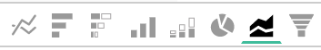

# Visualisierungsoptionen

Die Auswahl der richtigen Visualisierung für einen bestimmten Datensatz ist ein wichtiger Teil des Analyseprozesses. Jeder Datensatz hat eine Geschichte zu erzählen, aber die Wirkung dieser Geschichte wird durch ihre visuelle Wirkung und Lesbarkeit betont.

Die [!DNL MBI] `Visual Report Builder` bietet 12 verschiedene Visualisierungsoptionen mit jeweils eigenen Vorteilen und Anwendungsfällen. In diesem Artikel werden die verschiedenen Visualisierungsoptionen in [!DNL MBI], einschließlich ggf. erforderlicher Berichtskonfigurationen, sowie ein Anwendungsbeispiel. Die folgenden Visualisierungen sind in MBI verfügbar:

* `Scalar`
* `Table`
* `Line`
* `Bar`
* `Stacked Bar`
* `Column`
* `Stacked Column`
* `Pie`
* `Area`
* `Funnel`
* `Scatter plot`
* `Bubble`
* `Heatmap`

## `Scalar`

`Scalar` -Berichte werden als einzelner, numerischer Wert angezeigt. In den meisten Fällen wird dies verwendet, um den &quot;Allzeit&quot;-Wert einer Schlüsselmetrik wie Umsatz oder Bestellungen anzuzeigen oder den Umsatz mit dem Datum und dem Budget mit zwei separaten skalaren Berichten zu vergleichen. Im folgenden Beispiel zeigt dies einfach die Gesamtzahl der Bestellungen für das jeweilige Berichtsintervall:

Um einen Bericht als Skalar zu speichern, konfigurieren Sie Ihre Filter und Zeiteinstellungen und klicken Sie auf **[!UICONTROL Save]** oder **[!UICONTROL Update]** oben rechts im Bericht. Unter dem `Type` Dropdown-Liste wählen Sie die Zahl aus: Metrikname , um den Bericht als Wert zu speichern, der auf der linken Seitenleiste angezeigt wird.

**Voraussetzungen**:

* `Time interval`: `None`
* `Group by`: `None`
* Nur eine Metrik

## `Table`

Wie der Name nahe legt, `table` -Berichte eignen sich hervorragend für die Anzeige von Tabellendetails. Wenn eine große Anzahl von Gruppen nach Werten oder Metriken in einem einzelnen Bericht angezeigt werden muss, ist eine Tabelle häufig der beste Weg. Unten finden Sie eine Tabelle mit &quot;Kundendetails&quot;, in der Bestellungen und Umsatz nach E-Mail-Adresse des Kunden gruppiert sind:

Ähnlich wie bei skalaren Berichten können Sie einen Bericht als Tabelle speichern, indem Sie auf **[!UICONTROL Save]** oder **[!UICONTROL Update]** im ReportBuilder und wählen Sie dann die Tabellenoption unter der `Type` Dropdown-Liste.

**Voraussetzungen:**

* Es gibt zwar keine Anforderungen an die Berichtskonfiguration, es ist jedoch wichtig zu beachten, dass Tabellen auf 3500 Zeilen beschränkt sind. Wenn Ihr Datensatz mehr als 3500 Zeilen enthält, müssen Sie die Ergebnisse entweder filtern, um den Umfang einzugrenzen, oder die Ergebnisse exportieren nach `.csv` oder `Excel` , um den vollständigen Datensatz anzuzeigen.

## `Line`

`Line` -Diagramme sind die perfekte Wahl für den Vergleich der Leistung ähnlicher Metrikkohorten. So können Sie beispielsweise die Einnahmen zweier Regionen im selben Zeitraum analysieren oder das Jahreswachstum bei Auftragseingängen im Jahresvergleich vergleichen, wie unten dargestellt:

Jede zum Bericht hinzugefügte Metrik und Formel wird durch eine eigene Zeile dargestellt. Vergessen Sie beim Vergleich von Metriken mit ähnlichen Einheiten und Skalierungen nicht, das Kontrollkästchen für `Multiple Y-Axes` , um alle Metriken auf derselben Skala anzuzeigen.

Um einen Bericht als Liniendiagramm zu speichern, passen Sie den Bericht an `Type` nach `Chart`und wählen Sie die entsprechende Visualisierung aus der Berichterstellung aus, wie unten dargestellt:

**Voraussetzungen:**

* Keines

## `Bar`

`Bar` -Diagramme zeigen Ihre Daten als Reihe von horizontalen Balken an und eignen sich am besten zur Anzeige der Gesamtleistung einer begrenzten Anzahl von Metriken oder der Gruppe nach Werten. Beispielsweise könnte ein Balkendiagramm verwendet werden, um den Umsatz nach Geschäft zu vergleichen:

Jede einzelne Kombination aus Metrik, Gruppe nach und Zeitintervall wird als eigener Balken angezeigt. Wenn Sie zwei Metriken mit einer `group by`, die drei verschiedene `group by` -Werte, zeigt Ihr Bericht sechs separate Balken an.

Um einen Bericht als Balkendiagramm zu speichern, passen Sie den Bericht an `Type` nach `Chart` und wählen Sie die `Bar` wie unten gezeigt:

**Voraussetzungen:**

* Keines

## `Stacked Bar`

`Stacked bar` -Diagramme ähneln ihren Balkendiagrammbrüchen, mit der zusätzlichen Möglichkeit, die proportionale Aufschlüsselung der einzelnen Balken anzuzeigen. In den meisten Fällen werden gestapelte Balkendiagramme mit zwei oder mehr Metriken und einer einzigen Gruppe nach eingerichtet, sodass jede Leiste eine eindeutige Gruppe nach Wert darstellt, die auf die Metrikkomponenten aufgeteilt ist.

Beispielsweise weist der unten stehende Bericht zwei identische Umsatzmetriken auf: eine für Erstbestellungen gefiltert und die andere für Wiederholungsbestellungen gefiltert. Nach der Gruppierung nach Geschäft können Sie sowohl den Gesamtumsatzbeitrag für jeden Store (dargestellt durch die Gesamtbreite der Leiste) als auch die erstmalige und wiederholte Aufschlüsselung des Umsatzes für jeden Store sehen:

Stellen Sie sicher, dass `Multiple Y-Axes` deaktiviert ist, wenn Sie einen Bericht wie den oben stehenden einrichten.

Um einen Bericht als gestapeltes Balkendiagramm zu speichern, passen Sie den Bericht an `Type` nach `Chart` und wählen Sie die Option &quot;Gestapelte Leiste&quot;aus der Berichterstellung aus:

**Voraussetzungen:**

* Keines

## `Column`

`Column` -Diagramme stellen jeden Datenpunkt als vertikale Spalte dar und eignen sich im Allgemeinen besser für die Anzeige von Trend-Zeitdaten als für die horizontale Balkendiagrammvisualisierung. Da jede individuelle Metrik und Gruppe durch Kombination in einer eigenen Balkenreihe dargestellt wird, ist ein Spaltenbericht im Allgemeinen für Berichte mit drei oder weniger Metriken oder einer Metrik mit einer einzelnen Gruppe am besten geeignet, indem er 1-3 Gruppen nach Werten enthält.

Im folgenden Beispiel werden zwei Umsatzmetriken angezeigt: eine für den ersten Umsatz und die andere für den wiederholten Umsatz, wobei die Trends über einen Zeitraum nach Monaten verteilt sind:

Spaltenberichte können durch Ändern des Berichts gespeichert werden. `Type` nach `Chart`und wählen Sie die Spaltenvisualisierungsoption aus:

**Voraussetzungen:**

* Keines

## `Stacked Column`

`Stacked column` -Berichte sind fast identisch mit Spaltendiagrammen, allerdings werden ähnliche Spalten übereinander gestapelt, sodass die Gesamthöhe die Summe der Werte darstellt. Gestapelte Spalten lassen sich am besten mit einer begrenzten Anzahl von Metriken oder Gruppenbeiständen visualisieren.

Verwenden Sie dieselbe Berichtskonfiguration wie im Abschnitt `Column` weiter oben ein Bericht mit zwei Umsatzmetriken (gefiltert zum ersten Mal und wiederholt) mit einer gestapelten Spaltenvisualisierung wie folgt aussehen:

Auch hier ist es wichtig, dass die `Multiple Y-Axes` bei der Anzeige mehrerer Metriken mit der gestapelten Spaltenvisualisierung deaktiviert ist.

Um einen Bericht als gestapelte Spalte zu speichern, legen Sie den Bericht fest `Type` nach `Chart` und wählen Sie die `stacked column` Option:

**Voraussetzungen:**

* Keines

## `Pie`

`Pie` -Diagramme eignen sich am besten für die Anzeige einer einzelnen Metrik mit einem oder mehreren Gruppen-Bys oder mehrerer Metriken ohne Gruppenbys. In beiden Fällen muss das Zeitintervall auf &quot;Keine&quot;gesetzt werden, damit Daten in einem Kreisdiagramm angezeigt werden. Im folgenden Beispiel ist eine Metrik für einzelne Bestellungen eine Gruppe nach Store-Namen, um die Aufschlüsselung der Bestellungen nach Store anzuzeigen:

Um einen Bericht als Tortendiagramm zu speichern, legen Sie den Bericht fest `Type` nach `Chart` und wählen Sie die `pie` wie unten gezeigt:

**Voraussetzungen:**

* `Time interval`: `None`
* Sie haben eine der folgenden Möglichkeiten:
   * `Single metric with one or more group bys`
   * `Multiple metrics with no group bys`

## `Area`

`Area` -Diagramme sind fast mit gestapelten Spaltendiagrammen identisch, allerdings werden die Spalten kontinuierlich angezeigt. Ähnlich wie gestapelte Spalten werden Flächendiagramme am besten mit einer begrenzten Anzahl von Gruppenbys oder Metriken visualisiert.

Verwenden des gleichen Beispiels aus der `stacked column` angezeigt, zeigt der unten stehende Bericht den ersten Umsatz im Vergleich zum Wiederholungsumsatz mit der Visualisierung des Flächendiagramms:

Um einen Bericht als Flächendiagramm zu speichern, passen Sie die `Type` nach `Chart` und wählen Sie die Option Bereich aus:

**Voraussetzungen:**

* Keines

## `Funnel`

`Funnel` -Diagramme eignen sich ideal für die Visualisierung der Konvertierung über eine erwartete Ereignissequenz hinweg. Einige Beispiele sind die Analyse des potenziellen Umsatzes in Ihrem Verkaufstrichter vom Lead bis zum geschlossenen Geschäft oder die Messung des Rückgangs der Kunden zwischen ihren ersten und zweiten Bestellungen, zweiten und dritten Bestellungen usw. Nachstehend finden Sie ein Beispiel für Letztere:

In einem Trichterbericht spiegelt sich der relative Wert eines bestimmten Schritts des Trichters in der Höhe des Schritts wider, und die Reihenfolge, in der die Schritte angezeigt werden, wird durch die Berichtkonfiguration bestimmt. Es gibt zwei Möglichkeiten, einen Trichterbericht zu konfigurieren:

* `Single metric with one group by`: - Die Reihenfolge der Schritte wird durch die Einstellung &quot;Oben/Unten anzeigen&quot;der Gruppe von bestimmt. Standardmäßig werden Trichterschritte in der Reihenfolge vom größten zum kleinsten Wert angezeigt. Sie können sie aber auch alphabetisch nach Name sortieren.

* `Multiple metrics with no group by`: - Reihenfolge der Schritte, die durch die Reihenfolge bestimmt werden, in der die Metriken zum Bericht hinzugefügt werden.

Um einen Bericht als Trichterdiagramm zu speichern, passen Sie den Bericht an `Type` nach `Chart` und wählen Sie die entsprechende Visualisierung aus der Berichterstellung aus.

**Voraussetzungen:**

* `Time interval`: `None`
* Sie haben eine der folgenden Möglichkeiten:
   * `Single metric with one group by`
   * `Multiple metrics with no group by`

## `Scatter plot`

A `scatter plot` wird verwendet, um die Beziehung einer Metrik mit zwei verschiedenen Variablen zu untersuchen, damit Sie Korrelationen und Ausreißer leicht identifizieren können. Diese Visualisierung sollte am besten nur mit numerischen Dimensionen verwendet werden - versuchen Sie es mit der Metrik Bestellungen und dem `Customer's lifetime number of coupons` und `Customer's lifetime revenue` Dimensionen, um zu sehen, wie die Nutzung des Gutscheins mit dem Umsatz verbunden ist. Sie können zwischen einem Streudiagramm mit und ohne Trendlinie wählen:

**Voraussetzungen:**

Option 1:

* Zwei `metrics`
* One `group by`
* `Time interval`: `None`

Option 2:

* Zwei `metrics`
* Nein `group by`
* Satz `time interval`

## `Bubble` Diagramm

A `bubble` kann bis zu vier Datendimensionen anzeigen, wobei die `X` und `Y` Achsen bestimmen die Position der Blasen, die `Z` Achse ist die Größe der Blasen, und durch die Einbeziehung von zwei Gruppen Bys können Sie Farbe zu den Blasen hinzufügen. Diese Art der Visualisierung eignet sich am besten, wenn Sie mehrere Datendimensionen in einem Diagramm darstellen möchten.

Die folgende Tabelle zeigt beispielsweise die Anzahl der Kunden (Punktgröße), gruppiert nach einer bestimmten Akquise-Quelle (Blasenfarbe) und Status (verschiedene Blasen in einer bestimmten Farbe), gezeichnet anhand des Gesamtumsatzes und der durchschnittlichen Bestellungen während der Lebensdauer.

Die folgende Tabelle zeigt die Anzahl der Kunden (Blasengröße), gruppiert nach Akquisequelle (Blasenfarbe) und Status (verschiedene Blasen in einer bestimmten Farbe), gezeichnet anhand des durchschnittlichen Lebenszeitwerts und des Gesamtumsatzes.

**Anforderungen an Punktdiagramme einzelner Reihen:**

Option 1

* Drei `metrics`
* One `group by`
* `Time interval`: `None`

Option 2

* Drei `metrics`
* Nein `group by`
* Satz `time interval`

**Anforderungen für ein mehrreihenweises Punktdiagramm:**

* Drei `metrics`
* Zwei `group by`
* `Time interval`: `None`

## `Heatmap`

Verwendung `heatmaps` um Hotspots in Ihren Daten zu visualisieren. Beispielsweise kann eine Heatmap angeben, wo Sie routinemäßig ein höheres Volumen erhalten. Die Visualisierung dieser Daten kann Ihnen dabei helfen, Ihre Lagerbestände anzupassen, um sicherzustellen, dass Sie die Nachfrage während dieser Spitzenfenster erfüllen.

Die folgende Heatmap zeigt die Bestellungen über mehrere Wochen nach Wochentag, Stunde für Tag.

<!--{: width="650"}-->

**Voraussetzungen:**

Option 1

* One `metric`
* Zwei `group by`
* `Time interval`: `None`

Option 2

* One `metric`
* One `group by`
* Satz `time interval`
