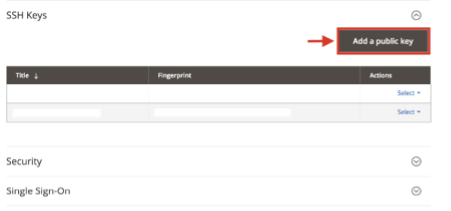
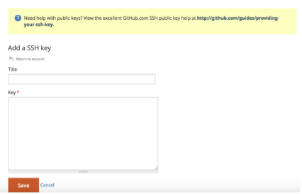
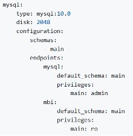

# Aktivieren Ihres [!DNL Commerce Intelligence] Kontos für On-Premise- und Starter-Abonnements

Um [!DNL Commerce Intelligence] für On-Premise-Abonnements zu aktivieren, erstellen Sie zunächst ein [!DNL Commerce Intelligence], geben Sie Ihre Einstellungsinformationen ein und verbinden Sie [!DNL Commerce Intelligence] dann mit Ihrer [!DNL Commerce]. <!-- For information about activation in `Cloud Starter` projects, see [Activating your [!DNL Commerce Intelligence] Account for `Cloud Starter` Subscriptions](../getting-started/cloud-activation.md).-->

## Create your [!DNL Commerce Intelligence] account

To create your account, contact your Adobe Account Team or Customer Technical Advisor.

## Create your password

After your account has been created, check your email for an account notification email from [!DNL The Magento BI Team@rjmetrics.com]. Use the link provided in the email to access your [!DNL Commerce Intelligence] account and create your password. Go to your inbox and verify your email address.

Wenn Sie keine E-Mail erhalten haben, wenden [&#x200B; sich an den Support](https://experienceleague.adobe.com/docs/commerce-knowledge-base/kb/troubleshooting/miscellaneous/mbi-service-policies.html?lang=de).

## Festlegen der Store-Voreinstellungen

Füllen Sie vor dem Konfigurieren der Datenbankverbindung das Formular Informationen speichern aus. Diese Informationen sind erforderlich, um die **[!UICONTROL Connect your Database]** Einrichtung abzuschließen.

## [!DNL Commerce Intelligence] Benutzer hinzufügen

Nachdem Sie Ihr Kennwort festgelegt und sich bei [!DNL Commerce Intelligence] angemeldet haben, können Sie weitere Benutzer zu Ihrem [!DNL Commerce Intelligence]-Konto hinzufügen. Fügen Sie beim Hinzufügen von Benutzern Admin-Benutzer mit entsprechenden Berechtigungen hinzu, um den Aktivierungsprozess abzuschließen.

## Erstellen Sie einen dedizierten [!DNL Commerce Intelligence]-Benutzer im [!DNL Commerce] Admin

Um [!DNL Commerce Intelligence] verwenden zu können, müssen Sie dem [!DNL Commerce]-Projekt einen permanenten und dedizierten Benutzer hinzufügen. Dieser dedizierte Benutzer dient als permanente Verbindung zu [!DNL Commerce], die den Abruf und die Übertragung neuer Daten an die [!DNL Commerce Intelligence] Data Warehouse des Kontos ermöglicht.

Configuring a dedicated [!DNL Commerce Intelligence] user ensures that the account is not deactivated or deleted, thus stopping the [!DNL Commerce Intelligence] connection.

>[!NOTE]
>
>Adobe encourages using an account name that indicate its permanent status (e.g., ACI-dedicated, ACI-database-connector, and so forth).

After you created the dedicated user for [!DNL Commerce Intelligence] in the Admin, add the same user to the primary environment of the [!DNL Commerce] project with a **[!UICONTROL Master]** setting of `Contributor`.

## Commerce Intelligence SSH-Schlüssel abrufen

1. On the [!UICONTROL Connect your database] page for [!DNL Commerce Intelligence] setup,  scroll down and select **[!UICONTROL Encryption settings]**.

1. For **Encryption Type**, select `SSH Tunnel`.

1. From the drop-down, copy the public key that is provided.

   

## Add your public key to the [!DNL Commerce Intelligence]

1. From the [!DNL Commerce Admin], sign in using the login information for the [!DNL Commerce Intelligence] user you just created.

1. Wählen Sie die **Kontoeinstellungen** aus.

1. Scrollen Sie nach unten und erweitern Sie die Dropdown-Liste **[!UICONTROL SSH Keys]** . Wählen Sie dann **[!UICONTROL Add a public key]** aus.

   

1. Fügen Sie den öffentlichen Schlüssel ein, den Sie im obigen [!DNL Encryption Type] kopiert haben.

   

## Bereitstellen von [!DNL Commerce Intelligence] Essentials-`MySQL`

1. Aktualisieren Sie Ihre `.magento/services.yaml`.

   

1. Aktualisieren Sie Ihre `.magento.app.yaml`.

   

## Get database connection information

Abrufen der Informationen zur Datenbankverbindung mit der zu [!DNL Commerce] [!DNL Commerce Intelligence] Datenbank

1. Führen Sie die folgenden Schritte aus, um Ihre Informationen zu erhalten.

   `echo $MAGENTO_CLOUD_RELATIONSHIPS | base64 --decode | json_pp`

1. Überprüfen Sie die Datenbankinformationen, die dem folgenden Beispiel ähneln sollten.

   

## [!DNL Commerce Intelligence] mithilfe einer verschlüsselten Verbindung mit Ihrer [!DNL Commerce] Datenbank verbinden

>[!NOTE]
>
>Adobe empfiehlt dringend, zur Herstellung der Datenbankverbindung einen [`SSH tunnel`](../data-analyst/importing-data/integrations/mysql-via-ssh-tunnel.md) zu verwenden. Wenn diese Methode jedoch keine Option ist, können Sie [!DNL Commerce Intelligence] mithilfe einer [`direct connection`](../data-analyst/importing-data/integrations/mysql-via-a-direct-connection.md) mit Ihrer Datenbank verknüpfen.

Geben Sie Ihre [!DNL Commerce Intelligence] im [!UICONTROL Connect your Magento Database] ein.

**Eingänge:**

[!UICONTROL Integration Name]: [Wählen Sie einen Namen für Ihre [!DNL Commerce Intelligence]]

[!UICONTROL Host]: `mbi.internal`

[!UICONTROL Port]: `3306`

[!UICONTROL Benutzername]: `mbi`

[!UICONTROL Password]: [Eingabekennwort im vorherigen Abschnitt angezeigt]

[!UICONTROL Database Name]: `main`

[!UICONTROL Table Prefixes]: [Leer lassen, wenn keine Tabellenpräfixe vorhanden sind]

## Einstellungen für [!UICONTROL **Zeitzone**] festlegen

**Inputs:**

[!UICONTROL Database Timezone]: `UTC`

[!UICONTROL Desired Timezone]: [choose the time zone for which you want your data to display]

## Abrufen von Informationen zu Verschlüsselungseinstellungen

Die Projekt-Benutzeroberfläche bietet eine SSH-Zugriffszeichenfolge. Diese Zeichenfolge kann verwendet werden, um die für „Remote [!UICONTROL **Adresse“**] &quot;[!UICONTROL **&quot;**] Informationen zu erfassen. Verwenden Sie die SSH-Zugriffszeichenfolge, indem Sie auf die Schaltfläche „Zugriff auf Site“ im Master-Zweig der Projekt-Benutzeroberfläche klicken. Suchen Sie dann Ihre [!UICONTROL User Name] und [!UICONTROL Remote Address] wie unten dargestellt.

## Input your [!DNL Encryption] settings

**Inputs:**

[!UICONTROL Encryption Type]: `SSH Tunnel`

[!UICONTROL Remote Address]: `ssh.us-3.magento.cloud`  [from the previous step]

[!UICONTROL Username]: `vfbfui4vmfez6-master-7rqtwti—mymagento` [aus dem vorherigen Schritt]

[!UICONTROL Port]: `22`

## Speichern Sie Ihre Integration.

Wenden Sie nach Abschluss der Konfigurationsschritte die Änderungen an, indem Sie [!UICONTROL **Integration speichern**] auswählen.

Sie haben jetzt Ihre [!DNL Commerce]-Datenbank erfolgreich mit Ihrem [!DNL Commerce Intelligence]-Konto verbunden.

>[!NOTE]
>
>Wenn Sie [!DNL Adobe Commerce Intelligence Pro] sind, wenden Sie sich an Ihren Customer Success Manager oder technischen Kundenberater, um die nächsten Schritte zu koordinieren.

Nachdem Sie die Konfiguration abgeschlossen haben, [&#x200B; Sie sich &#x200B;](../getting-started/sign-in.md) Ihrem [!DNL Commerce Intelligence] Konto an.

<!--
# Activate your [!DNL Commerce Intelligence] Account

To activate [!DNL Commerce Intelligence] for on-premise or `Cloud Pro` subscriptions, [contact support](https://experienceleague.adobe.com/docs/commerce-knowledge-base/kb/troubleshooting/miscellaneous/mbi-service-policies.html?lang=de).

>[!NOTE]
>
>Adobe no longer supports new `Cloud Starter` subscriptions.
-->
