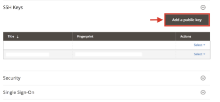

# Aktivieren Ihres [!DNL Commerce Intelligence] Kontos für On-Premise- und Starter-Abonnements

Um [!DNL Commerce Intelligence] für On-Premise-Abonnements zu aktivieren, erstellen Sie zunächst ein [!DNL Commerce Intelligence], geben Sie Ihre Einstellungsinformationen ein und verbinden Sie [!DNL Commerce Intelligence] dann mit Ihrer [!DNL Commerce]. <!-- For information about activation in `Cloud Starter` projects, see [Activating your [!DNL Commerce Intelligence] Account for `Cloud Starter` Subscriptions](../getting-started/cloud-activation.md).-->

## [!DNL Commerce Intelligence] Konto erstellen

Wenden Sie sich zur Erstellung Ihres Kontos an Ihr Adobe-Accountteam oder Ihren technischen Kundenberater.

## Kennwort erstellen

Nachdem Ihr Konto erstellt wurde, überprüfen Sie Ihre E-Mail auf eine Konto-Benachrichtigungs-E-Mail von [!DNL The Magento BI Team@rjmetrics.com]. Verwenden Sie den in der E-Mail angegebenen Link, um auf Ihr [!DNL Commerce Intelligence]-Konto zuzugreifen und Ihr Kennwort zu erstellen. Wechseln Sie zu Ihrem Posteingang und überprüfen Sie Ihre E-Mail-Adresse.

Wenn Sie keine E-Mail erhalten haben, wenden [ sich an den Support](https://experienceleague.adobe.com/docs/commerce-knowledge-base/kb/troubleshooting/miscellaneous/mbi-service-policies.html?lang=de).

## Festlegen der Store-Voreinstellungen

Füllen Sie vor dem Konfigurieren der Datenbankverbindung das Formular Informationen speichern aus. Diese Informationen sind erforderlich, um die **[!UICONTROL Connect your Database]** Einrichtung abzuschließen.

## [!DNL Commerce Intelligence] Benutzer hinzufügen

Nachdem Sie Ihr Kennwort festgelegt und sich bei [!DNL Commerce Intelligence] angemeldet haben, können Sie weitere Benutzer zu Ihrem [!DNL Commerce Intelligence]-Konto hinzufügen. Fügen Sie beim Hinzufügen von Benutzern Admin-Benutzer mit entsprechenden Berechtigungen hinzu, um den Aktivierungsprozess abzuschließen.

## Erstellen Sie einen dedizierten [!DNL Commerce Intelligence]-Benutzer im [!DNL Commerce] Admin

Um [!DNL Commerce Intelligence] verwenden zu können, müssen Sie dem [!DNL Commerce]-Projekt einen permanenten und dedizierten Benutzer hinzufügen. Dieser dedizierte Benutzer dient als permanente Verbindung zu [!DNL Commerce], die den Abruf und die Übertragung neuer Daten an die [!DNL Commerce Intelligence] Data Warehouse des Kontos ermöglicht.

Durch die Konfiguration eines dedizierten [!DNL Commerce Intelligence]-Benutzers wird sichergestellt, dass das Konto nicht deaktiviert oder gelöscht wird, sodass die [!DNL Commerce Intelligence] Verbindung unterbrochen wird.

>[!NOTE]
>
>Adobe empfiehlt die Verwendung eines Kontonamens, der den permanenten Status angibt (z. B. ACI-dediziert, ACI-Datenbank-Connector usw.).

Nachdem Sie den dedizierten Benutzer für die [!DNL Commerce Intelligence] im Admin-Bereich erstellt haben, fügen Sie denselben Benutzer zur primären Umgebung des [!DNL Commerce]-Projekts mit einer **[!UICONTROL Master]** von `Contributor` hinzu.

## Commerce Intelligence SSH-Schlüssel abrufen

1. Scrollen Sie auf der Seite [!UICONTROL Connect your database] für [!DNL Commerce Intelligence] Setup nach unten und wählen Sie **[!UICONTROL Encryption settings]** aus.

1. Wählen **für „Verschlüsselungstyp** die Option `SSH Tunnel` aus.

1. Kopieren Sie aus der Dropdown-Liste den bereitgestellten öffentlichen Schlüssel.

   

## Hinzufügen des öffentlichen Schlüssels zur [!DNL Commerce Intelligence]

1. Melden Sie sich von der [!DNL Commerce Admin] aus mit den Anmeldeinformationen für den [!DNL Commerce Intelligence] Benutzer an, den Sie gerade erstellt haben.

1. Wählen Sie die **Kontoeinstellungen** aus.

1. Scrollen Sie nach unten und erweitern Sie die Dropdown-Liste **[!UICONTROL SSH Keys]** . Wählen Sie dann **[!UICONTROL Add a public key]** aus.

   

1. Fügen Sie den öffentlichen Schlüssel ein, den Sie im obigen [!DNL Encryption Type] kopiert haben.

   

## Bereitstellen von [!DNL Commerce Intelligence] Essentials-`MySQL`

1. Aktualisieren Sie Ihre `.magento/services.yaml`.

   

1. Aktualisieren Sie Ihre `.magento.app.yaml`.

   

## Abrufen von Datenbankverbindungsinformationen

Abrufen der Informationen zur Datenbankverbindung mit der zu [!DNL Commerce] [!DNL Commerce Intelligence] Datenbank

1. Führen Sie die folgenden Schritte aus, um Ihre Informationen zu erhalten.

   `echo $MAGENTO_CLOUD_RELATIONSHIPS | base64 --decode | json_pp`

1. Überprüfen Sie die Datenbankinformationen, die dem folgenden Beispiel ähneln sollten.

   

## [!DNL Commerce Intelligence] mithilfe einer verschlüsselten Verbindung mit Ihrer [!DNL Commerce] Datenbank verbinden

>[!NOTE]
>
>Adobe empfiehlt dringend, zur Herstellung der Datenbankverbindung einen [`SSH tunnel`](../data-analyst/importing-data/integrations/mysql-via-ssh-tunnel.md) zu verwenden. Wenn diese Methode jedoch keine Option ist, können Sie [!DNL Commerce Intelligence] mithilfe einer [`direct connection`](../data-analyst/importing-data/integrations/mysql-via-a-direct-connection.md) mit Ihrer Datenbank verknüpfen.

Geben Sie Ihre [!DNL Commerce Intelligence] im [!UICONTROL Connect your Magento Database] ein.

**Eingänge:**

[!UICONTROL Integration Name]: [Wählen Sie einen Namen für Ihre [!DNL Commerce Intelligence]]

[!UICONTROL Host]: `mbi.internal`

[!UICONTROL Port]: `3306`

[!UICONTROL Benutzername]: `mbi`

[!UICONTROL Password]: [Eingabekennwort im vorherigen Abschnitt angezeigt]

[!UICONTROL Database Name]: `main`

[!UICONTROL Table Prefixes]: [Leer lassen, wenn keine Tabellenpräfixe vorhanden sind]

## Einstellungen für [!UICONTROL **Zeitzone**] festlegen

**Eingänge:**

[!UICONTROL Database Timezone]: `UTC`

[!UICONTROL Desired Timezone]: [Wählen Sie die Zeitzone aus, für die Ihre Daten angezeigt werden sollen]

## Abrufen von Informationen zu Verschlüsselungseinstellungen

Die Projekt-Benutzeroberfläche bietet eine SSH-Zugriffszeichenfolge. Diese Zeichenfolge kann verwendet werden, um die für „Remote [!UICONTROL **Adresse“**] &quot;[!UICONTROL **&quot;**] Informationen zu erfassen. Verwenden Sie die SSH-Zugriffszeichenfolge, indem Sie auf die Schaltfläche „Zugriff auf Site“ im Master-Zweig der Projekt-Benutzeroberfläche klicken. Suchen Sie dann Ihre [!UICONTROL User Name] und [!UICONTROL Remote Address] wie unten dargestellt.

## [!DNL Encryption] eingeben

**Eingänge:**

[!UICONTROL Encryption Type]: `SSH Tunnel`

[!UICONTROL Remote Address]: `ssh.us-3.magento.cloud` [aus dem vorherigen Schritt]

[!UICONTROL Username]: `vfbfui4vmfez6-master-7rqtwti—mymagento` [aus dem vorherigen Schritt]

[!UICONTROL Port]: `22`

## Speichern Sie Ihre Integration.

Wenden Sie nach Abschluss der Konfigurationsschritte die Änderungen an, indem Sie [!UICONTROL **Integration speichern**] auswählen.

Sie haben jetzt Ihre [!DNL Commerce]-Datenbank erfolgreich mit Ihrem [!DNL Commerce Intelligence]-Konto verbunden.

>[!NOTE]
>
>Wenn Sie [!DNL Adobe Commerce Intelligence Pro] sind, wenden Sie sich an Ihren Customer Success Manager oder technischen Kundenberater, um die nächsten Schritte zu koordinieren.

Nachdem Sie die Konfiguration abgeschlossen haben, [ Sie sich ](../getting-started/sign-in.md) Ihrem [!DNL Commerce Intelligence] Konto an.

<!---# Activate your [!DNL Commerce Intelligence] Account 

To activate [!DNL Commerce Intelligence] for on-premise or `Cloud Pro` subscriptions, [contact support](https://experienceleague.adobe.com/docs/commerce-knowledge-base/kb/troubleshooting/miscellaneous/mbi-service-policies.html?lang=de).

>[!NOTE]
>
>Adobe no longer supports new `Cloud Starter` subscriptions.--->
