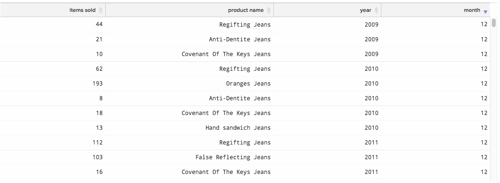

# Erstellen von Visualisierungen aus SQL-Abfragen

Ziel dieses Tutorials ist es, Sie mit der in der [!DNL SQL Report Builder] verwendeten Terminologie vertraut zu machen und Ihnen eine solide Grundlage für die Erstellung von `SQL visualizations` zu bieten.

Der [[!DNL SQL Report Builder]](../data-analyst/dev-reports/sql-rpt-bldr.md) ist ein Report Builder mit Optionen: Sie können eine Abfrage zum einzigen Zweck des Abrufs einer Datentabelle ausführen oder diese Ergebnisse in einen Bericht umwandeln. In diesem Tutorial wird erläutert, wie Sie eine Visualisierung aus einer SQL-Abfrage erstellen.

## Terminologie

Bevor Sie mit diesem Tutorial beginnen, lesen Sie die folgende Terminologie, die in der `SQL Report Builder` verwendet wird.

- `Series`: Die Spalte, die Sie messen möchten, wird in der SQL-Report Builder als Serie bezeichnet. Häufige Beispiele sind `revenue`, `items sold` und `marketing spend`. Zum Erstellen einer Visualisierung muss mindestens eine Spalte als `Series` festgelegt werden.

- `Category`: Die Spalte, die Sie zum Segmentieren Ihrer Daten verwenden möchten, wird als `Category` bezeichnet. Dies entspricht der `Group By` Funktion in der [`Visual Report Builder`](../data-user/reports/ess-rpt-build-visual.md). Wenn Sie beispielsweise den Umsatz Ihrer Kundinnen und Kunden während ihrer Lebensdauer nach ihrer Akquisequelle segmentieren möchten, wird die Spalte, die die Akquisequelle enthält, als `Category` angegeben. Es können mehrere Spalten als `Category` festgelegt werden.

>[!NOTE]
>
>Datumsangaben und Zeitstempel können auch `Categories` verwendet werden. Sie sind nur eine weitere Datenspalte in Ihrer Abfrage und müssen in der Abfrage selbst nach Wunsch formatiert und sortiert sein.

- `Labels`: Diese werden als X-Achsen-Beschriftungen angewendet. Bei der Analyse von Daten-Trends im Zeitverlauf werden die Spalten für Jahr und Monat als Bezeichnungen angegeben. Es kann mehr als eine Spalte als Beschriftung festgelegt werden.

## Schritt 1: Abfrage schreiben

Beachten Sie Folgendes:

- Die [!DNL SQL Report Builder] verwendet [`Redshift SQL`](https://docs.aws.amazon.com/redshift/latest/dg/c_redshift-and-postgres-sql.html).

- Wenn Sie einen Bericht mit einer Zeitreihe erstellen, stellen Sie sicher, dass Sie die Zeitstempelspalten `ORDER BY`. Dadurch wird sichergestellt, dass die Zeitstempel im Bericht in der richtigen Reihenfolge dargestellt werden.

- Die `EXTRACT`-Funktion eignet sich hervorragend zum Analysieren des Tages, der Woche, des Monats oder des Jahres des Zeitstempels. Dies ist nützlich, wenn die `time interval`, die Sie für den Bericht verwenden möchten, `daily`, `weekly`, `monthly` oder `yearly` ist.

Öffnen Sie zunächst die [!DNL SQL Report Builder], indem Sie auf **[!UICONTROL Report Builder** > **SQL Report Builder]** klicken.

Betrachten Sie als Beispiel diese Abfrage, die die monatliche Gesamtzahl der für jedes Produkt verkauften Artikel zurückgibt:

```sql
    SELECT SUM("qty") AS "Items Sold", "products's name" AS "product name",
    EXTRACT(year from "Order date") AS "year",
    EXTRACT(month from "Order date") AS "month"
    FROM "items"
    WHERE "products's name" LIKE '%Jeans'
    GROUP BY  "products's name", "year","month"
    ORDER BY "year" ASC,"month" ASC
    LIMIT 3500
```

Diese Abfrage gibt die folgende Ergebnistabelle zurück:



## Schritt 2: Visualisierung erstellen

Mit diesen Ergebnissen *Sie, wie Sie die Visualisierung erstellen.* Klicken Sie zunächst auf die Registerkarte **[!UICONTROL Chart]** im `Results`. Dadurch wird die Registerkarte `Chart settings` angezeigt.

Wenn eine Abfrage zum ersten Mal ausgeführt wird, kann der Bericht undurchsichtig aussehen, da alle Spalten in der Abfrage als Serie dargestellt werden:


In diesem Beispiel soll dies ein Liniendiagramm sein, das die Entwicklung im Zeitverlauf anzeigt. Verwenden Sie zum Erstellen die folgenden Einstellungen:

- `Series`: Wählen Sie die `Items sold` als `Series` aus, da Sie sie messen möchten. Nachdem Sie eine `Series` definiert haben, wird im Bericht eine einzelne Zeile angezeigt.

- `Category`: In diesem Beispiel möchten Sie jedes Produkt als eine andere Zeile im Bericht anzeigen. Legen Sie dazu `Product name` als `Category` fest.

- `Labels`: Verwenden Sie die Spalten `year` und `month` als Beschriftungen auf der X-Achse, um `Items Sold` als Trend im Zeitverlauf anzeigen zu können.

>[!NOTE]
>
>Die Abfrage muss eine `ORDER BY`-Klausel für die Beschriftungen enthalten, wenn es sich um `date`/`time` Spalten handelt.

Nachstehend finden Sie einen kurzen Überblick über die Erstellung dieser Visualisierung, von der Ausführung der Abfrage bis zur Einrichtung des Berichts:


## Schritt 3: `Chart Type` auswählen

In diesem Beispiel wird der Diagrammtyp `Line` verwendet. Um einen anderen `chart type` zu verwenden, klicken Sie auf die Symbole über dem Abschnitt Diagrammoptionen , um ihn zu ändern:


## Schritt 4: Speichern Sie die Visualisierung

Wenn Sie diesen Bericht erneut verwenden möchten, geben Sie dem Bericht einen Namen und klicken Sie oben rechts auf **[!UICONTROL Save]** .

Wählen Sie in der Dropdown-Liste `Chart` als `Type` und dann ein Dashboard aus, in dem der Bericht gespeichert werden soll.

## Verpackung

Möchten Sie einen Schritt weiter gehen? Sehen Sie sich die [Best Practices zur Abfrageoptimierung](../best-practices/optimizing-your-sql-queries.md) an.
