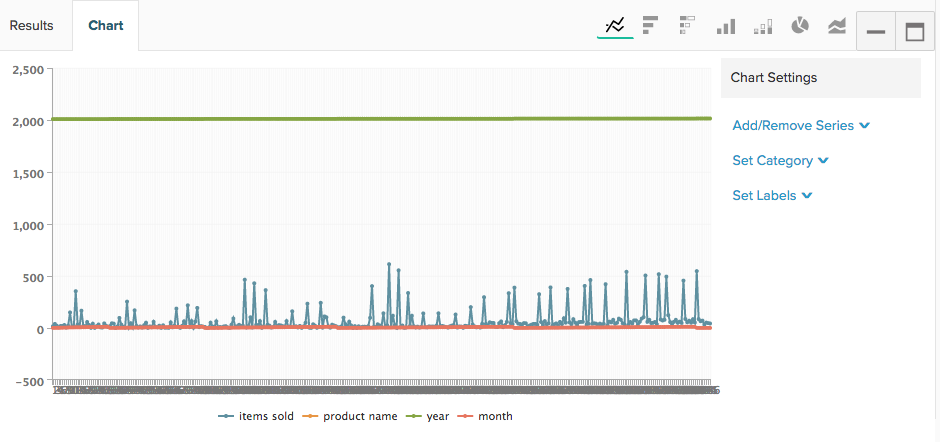

# Erstellen von Visualisierungen aus SQL-Abfragen

Ziel dieses Tutorials ist es, Sie mit der in der [!DNL SQL Report Builder] und geben Ihnen eine solide Grundlage für die Erstellung `SQL visualizations`.

Die [[!DNL SQL Report Builder]](../data-analyst/dev-reports/sql-rpt-bldr.md) ist ein ReportBuilder mit Optionen: Sie können eine Abfrage ausführen, um nur eine Datentabelle abzurufen, oder Sie können diese Ergebnisse in einen Bericht umwandeln. In diesem Tutorial wird beschrieben, wie Sie eine Visualisierung aus einer SQL-Abfrage erstellen.

## Terminologie

Bevor Sie mit diesem Tutorial beginnen, lesen Sie die folgende in der `SQL Report Builder`.

- `Series`: Die Spalte, die Sie messen möchten, wird im SQL-Report Builder als Reihe bezeichnet. Häufige Beispiele `revenue`, `items sold`, und `marketing spend`. Mindestens eine Spalte muss als `Series` , um eine Visualisierung zu erstellen.

- `Category`: Die Spalte, die Sie zur Segmentierung Ihrer Daten verwenden möchten, wird als `Category` Das ist genau wie das `Group By` in der [`Visual Report Builder`](../data-user/reports/ess-rpt-build-visual.md). Wenn Sie beispielsweise den Umsatz Ihrer Kunden über die gesamte Lebensdauer nach ihrer Akquisequelle segmentieren möchten, wird die Spalte mit der Akquisequelle als `Category`. Mehr als eine Spalte kann als `Category`.

>[!NOTE]
>
>Daten und Zeitstempel können auch als `Categories`. Es handelt sich lediglich um eine weitere Datenspalte in Ihrer Abfrage, die in der Abfrage selbst nach Bedarf formatiert und sortiert werden muss.

- `Labels`: Diese werden als X-Achsen-Beschriftungen angewendet. Bei der Analyse von Datentrends im Zeitverlauf werden die Spalten für Jahr und Monat als Titel angegeben. Es kann mehr als eine Spalte als Titel festgelegt werden.

## Schritt 1: Abfrage schreiben

Beachten Sie Folgendes:

- Die [!DNL SQL Report Builder] uses [`Redshift SQL`](https://docs.aws.amazon.com/redshift/latest/dg/c_redshift-and-postgres-sql.html).

- Wenn Sie einen Bericht mit einer Zeitreihe erstellen, stellen Sie sicher, dass `ORDER BY` die Zeitstempelspalte. Dadurch wird sichergestellt, dass die Zeitstempel im Bericht in der richtigen Reihenfolge dargestellt werden.

- Die `EXTRACT` eignet sich hervorragend für die Analyse des Tages, der Woche, des Monats oder des Jahres des Zeitstempels. Dies ist nützlich, wenn die Variable `time interval` Sie für den Bericht verwenden möchten: `daily`, `weekly`, `monthly`oder `yearly`.

Öffnen Sie zunächst die [!DNL SQL Report Builder] durch Klicken auf **[!UICONTROL Report Builder** > **SQL Report Builder]**.

Betrachten Sie als Beispiel diese Abfrage, die die monatliche Gesamtzahl der verkauften Artikel für jedes Produkt zurückgibt:

```sql
    SELECT SUM("qty") AS "Items Sold", "products's name" AS "product name",
    EXTRACT(year from "Order date") AS "year",
    EXTRACT(month from "Order date") AS "month"
    FROM "items"
    WHERE "products's name" LIKE '%Jeans'
    GROUP BY  "products's name", "year","month"
    ORDER BY "year" ASC,"month" ASC
    LIMIT 3500
```

Diese Abfrage gibt die folgende Ergebnistabelle zurück:


## Schritt 2: Erstellen der Visualisierung

Mit diesen Ergebnissen *Wie erstellen Sie die Visualisierung?* Klicken Sie zunächst auf die Schaltfläche **[!UICONTROL Chart]** im `Results` -Bereich. Dadurch wird die `Chart settings` Registerkarte.

Wenn eine Abfrage zum ersten Mal ausgeführt wird, kann der Bericht undurchsichtig aussehen, da alle Spalten in der Abfrage als Reihe dargestellt werden:



In diesem Beispiel soll es sich um ein Liniendiagramm handeln, das sich im Zeitverlauf entwickelt. Verwenden Sie zum Erstellen die folgenden Einstellungen:

- `Series`: Wählen Sie die `Items sold` als `Series` da Sie es messen möchten. Nachdem Sie die `Series` -Spalte wird eine einzelne Zeile im Bericht angezeigt.

- `Category`: In diesem Beispiel möchten Sie jedes Produkt als eine andere Zeile im Bericht anzeigen. Dazu legen Sie Folgendes fest: `Product name` als `Category`.

- `Labels`: Verwenden Sie die Spalten `year` und `month` als Beschriftungen auf der X-Achse, um sie anzeigen zu können `Items Sold` als Trend im Zeitverlauf.

>[!NOTE]
>
>Die Abfrage muss eine `ORDER BY` -Klausel auf den Bezeichnungen, wenn sie `date`/`time` Spalten.

Im Folgenden sehen Sie, wie Sie diese Visualisierung erstellt haben, von der Ausführung der Abfrage bis zur Einrichtung des Berichts:


## Schritt 3: Auswählen einer `Chart Type`

In diesem Beispiel wird die `Line` Diagrammtyp. So verwenden Sie eine andere `chart type`klicken Sie auf die Symbole über dem Abschnitt Grafikoptionen , um ihn zu ändern:


## Schritt 4: Speichern der Visualisierung

Wenn Sie diesen Bericht erneut verwenden möchten, geben Sie dem Bericht einen Namen und klicken Sie auf **[!UICONTROL Save]** in der oberen rechten Ecke.

Wählen Sie im Dropdown-Menü `Chart` als `Type` und dann ein Dashboard, in dem der Bericht gespeichert werden soll.

## Aufwischen

Willst du noch einen Schritt weiter gehen? Sehen Sie sich die [Best Practices zur Abfrageoptimierung](../best-practices/optimizing-your-sql-queries.md).
