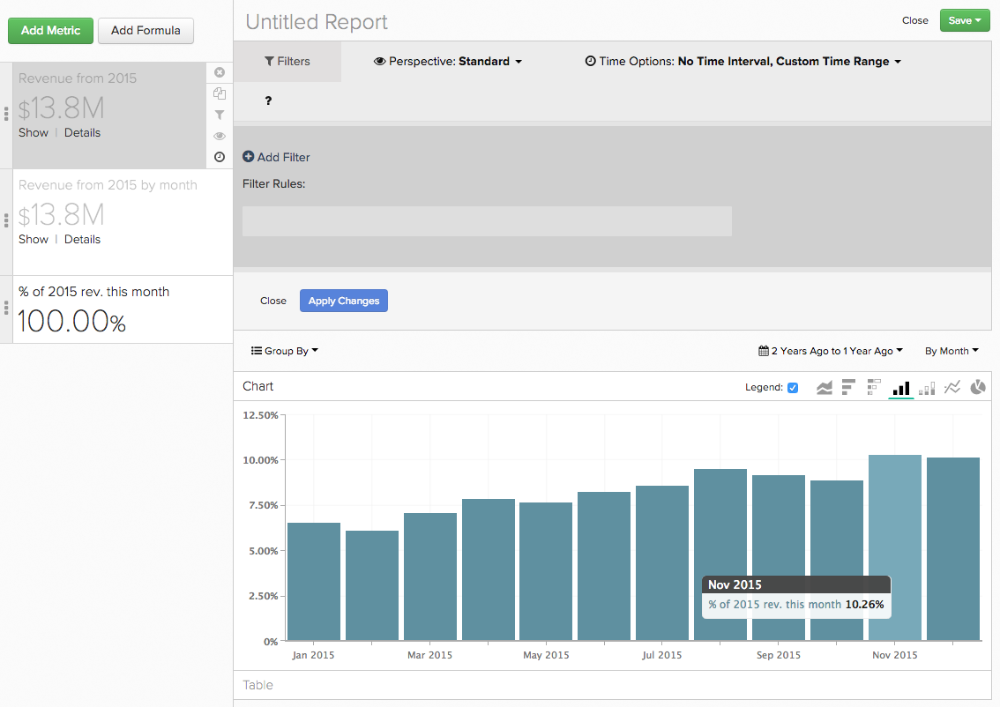

# Verwendung `Time` Optionen in `Visual Report Builder`

Eines der Merkmale der `Visual Report Builder` ist der globale `Time Range` und `Interval` -Einstellungen. Mit diesen Einstellungen können Sie die Daten in Ihrem Bericht für einen bestimmten Zeitraum analysieren.

Bei einigen Analysen müssen Sie jedoch möglicherweise verschiedene Zeitbereiche oder Zeitintervalle im selben Bericht berücksichtigen. Dort `Time` Optionen werden angezeigt. So erhalten Sie eine bessere Vorstellung von der Verwendung von `Time` Optionen in Ihren Berichten. Dieses Tutorial behandelt die folgenden Anwendungsfälle:

* [Analysieren von Metriken ohne Zeitstempel](#notimestamp)
* [Geben einer Metrik ein unabhängiges Zeitintervall](#independenttimeinterval)
* [Vergleichen derselben Metrik über verschiedene Zeiträume hinweg](#difftimerange)

Wenn Sie einige der in diesem Thema besprochenen Beispielberichte befolgen möchten, öffnen Sie die [`Visual Report Builder`](../data-user/reports/ess-rpt-build-visual.md) vor dem Fortfahren.

## Analysieren von Metriken ohne Zeitstempel {#notimestamp}

Einige Metriken können einfach keine Trendbildung im Zeitverlauf vornehmen, da die Daten nicht mit einem zugehörigen Zeitstempel erfasst oder gespeichert werden. Beispielsweise enthält eine Bestandstabelle oft nur eine Zeile für jede SKU. In diesem Fall sollten Sie [Metrik erstellen](../data-user/reports/ess-manage-data-metrics.md) ohne einen Zeitstempel anzugeben.

Wenn Sie eine solche Metrik in Ihren Berichten verwenden, stellen Sie fest, dass durch das Hinzufügen dieser Metrik zu einem Bericht automatisch eine unabhängige `Time Interval` von `None` und `Time Range` von `Global`:

## Geben einer Metrik ein unabhängiges Zeitintervall {#independenttimeinterval}

`Time` Mit Optionen können Sie zeitbasierte 100-%-Diagramme erstellen, um zu ermitteln, welcher Tag, welche Woche, welcher Monat oder welches Jahr während eines bestimmten Zeitraums am meisten beigetragen hat. In diesem Abschnitt erstellen wir eine Grafik, die Ihnen den Prozentsatz des Umsatzes anzeigt, der in jedem Kalendermonat eines Jahres generiert wurde.

Dieser Berichtstyp kann nützlich sein, wenn Sie den Umsatz vergleichen möchten, der im Jahresvergleich generiert wurde. Wenn beispielsweise in einem Diagramm für 2015 aufgezeigt wird, dass der Januar 18 % des Umsatzes für das Jahr beigetragen hat und einer für 2016 nur 8 % zeigte, könnten Sie damit beginnen zu recherchieren, was geschehen sein könnte.

1. Fügen Sie Ihre `Revenue` zum Bericht hinzu.
1. Klicken **[!UICONTROL Duplicate]** , um eine Kopie der Metrik zu erstellen.
1. Klicken Sie auf die globale **[!UICONTROL Time Range]** Option, dann **[!UICONTROL Moving Time Range]**. Legen Sie hier fest `Last Year`.
1. Klicken Sie auf die globale **[!UICONTROL Time Interval]** und legen Sie sie auf `Monthly`.
1. Report Builder fügt für eine zweite Metrik automatisch eine zweite Y-Achse hinzu. Deaktivieren Sie die `Multiple Y-Axes` ankreuzen.
1. Als Nächstes wenden wir eine unabhängige `Time Interval` zur ersten Metrik. Klicken **[!UICONTROL Time Options]** (Uhrensymbol) rechts neben dem `first Revenue metric`.
1. Klicken **[!UICONTROL Time Options]** im erweiterten Fenster, das über dem Bericht angezeigt wird.
1. Legen Sie im Dropdown-Menü Folgendes fest:

   * `Time Interval`: setzen Sie dies auf `None`.

   * `Time Range`: setzen Sie dies auf `Last Year` durch erstmaliges Klicken **[!UICONTROL Custom]**, dann **[!UICONTROL Moving Range]** und schließlich die Auswahl der `Last Year` -Option.

   * Klicken **[!UICONTROL Apply]** , um die Intervall- und Bereichseinstellungen zu speichern. Dadurch wird eine Metrik erstellt, die den Gesamtumsatz des Vorjahres berechnet. Als Nächstes verwenden wir diese Metrik als Nenner in einer Formel.

   * Um den Prozentsatz des Umsatzes für jeden Monat anzuzeigen, müssen wir dem Bericht eine Formel hinzufügen. Klicken **[!UICONTROL Add Formula]**.

   * Eingabe `B/A` im Feld Formel und wählen Sie `% Percent` aus dem Dropdown-Menü neben dem Textfeld. Mit dieser Formel wird der Umsatzbetrag von einem bestimmten Monat im letzten Jahr durch den Gesamtumsatz im letzten Jahr dividiert.

   * Klicken **[!UICONTROL Apply Changes]**.

   * Blenden Sie beide Eingabemetriken aus und benennen Sie die Formel um.

Nun können wir sehen, wie effektiv jeder Monat im letzten Jahr war:

## Vergleichen derselben Metrik über verschiedene Zeiträume hinweg {#difftimerange}

In diesem Beispiel wird eine benutzerdefinierte Dimension namens `Day number of the month`. Wenn Sie diesen Bericht erstellen möchten und diese Dimension noch nicht in Ihrer Data Warehouse haben, [Support kontaktieren](https://experienceleague.adobe.com/docs/commerce-knowledge-base/kb/troubleshooting/miscellaneous/mbi-service-policies.html?lang=en) Hilfe.

Die beiden häufigsten Beispiele in dieser Kategorie sind (1) der Vergleich von Wachstumsmetriken (Umsatz im Jahr oder Monat im Monat) und (2) ein besseres Verständnis aktueller Inventar- oder Artikelverkaufstrends.

Um diesen Anwendungsfall zu demonstrieren, betrachten wir den täglichen Umsatz des Vormonats im Vergleich zum Vorjahresmonat. Nehmen wir an, wir wollen die Einnahmen für jeden Tag im Januar 2016 betrachten und dann mit Januar 2015, Januar 2014 usw. vergleichen - dieser Bericht würde uns das zeigen.

1. Fügen Sie Ihre `Revenue` zum Bericht hinzu.
1. Klicken **[!UICONTROL Duplicate]** , um eine Kopie der Metrik zu erstellen.
1. Benennen Sie die erste Metrik in `Items sold last 7 days` und die zweite Metrik `Items sold last 28 days`.
1. Klicken **[!UICONTROL Time Range]**, dann **[!UICONTROL Moving Time Range]**. Legen Sie hier fest `Last Month`.
1. Klicken **[!UICONTROL Time Interval]** und legen Sie `None`.
1. Klicken **[!UICONTROL Time Options]** (Uhrensymbol) neben der zweiten `Revenue` Metrik.
1. Klicken **[!UICONTROL Time Options]** im erweiterten Fenster, das über dem Bericht angezeigt wird.
1. Legen Sie im Dropdown-Menü Folgendes fest:

   * `Time Interval`: setzen Sie dies auf `None`.

   * `Time Range`: setzen Sie dies auf `From 14 Months Ago To 13 Months Ago` durch erstmaliges Klicken **[!UICONTROL Custom]** then **[!UICONTROL Moving Range]**. Verwenden Sie die Felder und Dropdown-Listen oben im Menü, um den Bereich festzulegen. Diese Einstellung ermöglicht es uns, den Umsatz des Vormonats, aber des Vorjahres zu sehen.
   Machen Sie sich keine Gedanken, wenn die Metrik aus dem Bericht verschwindet. Wenn Sie unabhängige Zeitoptionen festlegen, wird die Metrik automatisch aus dem Bericht ausgeblendet. Um es erneut anzuzeigen, klicken Sie auf **[!UICONTROL Show]** neben der Metrik.

   

   * Klicken **[!UICONTROL Apply]** , um die Intervall- und Bereichseinstellungen zu speichern.

   * Als Nächstes fügen wir unsere benutzerdefinierten `Day number of the month` Dimension durch Klicken auf **[!UICONTROL Group By]** und wählen Sie die Dimension aus. Dadurch wird die Tagesnummer des Monats einer Bestellung zurückgegeben, z. B. wird eine am 2. März aufgegebene Bestellung zurückgegeben `2`.

   * Im `Group By` Dropdown-Liste auswählen `Show All` und klicken Sie auf **[!UICONTROL Apply]**. Dadurch werden die X-Achsen-Werte für den Bericht effektiv erstellt:

   

   * Benennen Sie die Metriken um. In unserem Beispiel lautet die erste Metrik: `Revenue - 2015` und der zweite `Revenue - 2014`.

Weitere häufige Verwendung benutzerdefinierter `Time Options` ist die Bestimmung der Lieferwochen. Insbesondere während der Weihnachtszeit oder eines speziellen Werbezeitraums können Sie Artikel berücksichtigen, die in der letzten Woche, im letzten Monat und im vorherigen Werbezeitraum verkauft wurden, um fundierte Kaufentscheidungen treffen zu können.

Denken Sie daran, die Zeiträume auf das zu setzen, was Sie beim Erstellen dieses Berichts selbst benötigen.

1. Fügen Sie Ihre `Items Sold` zum Bericht hinzu.
1. Klicken **[!UICONTROL Duplicate]** , um eine Kopie der Metrik zu erstellen.
1. Benennen Sie die Metriken um. Sie können die gleichen Namen wie wir verwenden oder etwas Ähnliches verwenden:
   1. Benennen Sie die erste Metrik in `Items sold last 7 days`.
   1. Benennen Sie die zweite Metrik in `Items sold last 28 days`.
1. Im `Items sold last 7 days` Metrik, klicken Sie auf die globale **[!UICONTROL Time Range]** Option dann **[!UICONTROL Moving Time Range]**. Für dieses Beispiel setzen wir es auf `Last 7 Days`.
1. Klicken **[!UICONTROL Time Interval]** und legen Sie `None`.
1. Als Nächstes definieren wir die `Time Options` für `Items sold last 28 days` Metrik. Klicken **[!UICONTROL Time Options]** (Uhrensymbol) rechts neben dem `second Items sold` Metrik.
1. Klicken **[!UICONTROL Time Options]** im erweiterten Fenster, das über dem Bericht angezeigt wird.
1. Legen Sie im Dropdown-Menü Folgendes fest:

   * `Time Interval`: setzen Sie dies auf `None`.
   * `Time Range`: setzen Sie dies auf `From 29 days to 1 day ago` durch erstmaliges Klicken **[!UICONTROL Custom]**, dann **[!UICONTROL Moving Range]**. Verwenden Sie die Felder und Dropdown-Listen oben im Menü, um den Bereich festzulegen.
   * Klicken **[!UICONTROL Apply]** , um die Intervall- und Bereichseinstellungen zu speichern.
   * Duplizieren Sie die `Items sold last 28 days` Metrik erstellen und die neue Metrik öffnen `Time Options`. Legen Sie die Optionen auf Folgendes fest:

      * `Time Interval`: Lassen Sie dies als `None`.
      * `Time Range`: Ändern Sie diesen in den Datumsbereich, der mit der Promotion, an der Sie interessiert sind, übereinstimmt, indem Sie auf **[!UICONTROL Specific Date Range]** und die entsprechenden Daten eingeben.
      * Metrik umbenennen `Items sold during last promotion` oder etwas Ähnliches.
      * Fügen Sie Ihre `Units on hand` Metrik.
      * Als Nächstes müssen wir die Berechnungen hinzufügen, die uns die Wochen zeigen, unter Berücksichtigung der Verkaufstrends, für die Zeiträume (`last 7 days`, `last 28 days`und `last promo` -Zeitraum), die wir in den Bericht aufnehmen. Sie müssen dies einmal für jeden Zeitraum tun.

Um die Formeln zu erstellen, klicken Sie auf **[!UICONTROL Add Formula]**. Geben Sie die folgenden Formeln ein und klicken Sie auf **[!UICONTROL Apply Changes]** wenn fertig. Wiederholen Sie diesen Vorgang für jeden der drei Zeiträume:

* Für `last 7 days time period`, eingeben `D / A` im `Formula` -Feld.
* Für `last 28 days time period`, eingeben `D / (B/4)` im `Formula` -Feld.

   >[!NOTE]
   >
   >Es ist wichtig, die ausgewählten Zeiträume hier zu normalisieren. In diesem Beispiel sollten 28 Tage in vier Wochen aufgeteilt werden. Möglicherweise müssen Sie eine andere Logik auf die Formel anwenden.

* Für `last promo period`, eingeben `D / C` im `Formula` -Feld.

   

* Passen Sie schließlich den Bericht an, indem Sie die Metriken ausblenden und eine `SKU` oder eine ähnliche Dimension wie der Bericht als `Group By`.

Dieses Beispiel zeigt, dass die aktuellen Lagerbestände für einen produktweiten 14-tägigen Verkauf gut positioniert waren. Wenn jedoch ein vergleichbarer Werbezeitraum hinzugefügt wird, muss das Unternehmen einige Änderungen vornehmen - entweder indem es mehr Inventar bestellt und nur Artikel mit genügend Lagereinheiten bewirbt.

Da sich Ihre Kunden im Laufe der Zeit anders verhalten, können Sie bei der Durchführung von Analysen mit Abweichungen in den Daten rechnen. Durch das Festlegen benutzerdefinierter Zeitoptionen können Sie schnell komplexe Analysen erstellen und datengesteuerte Entscheidungen ermöglichen, die historische Trends berücksichtigen.

