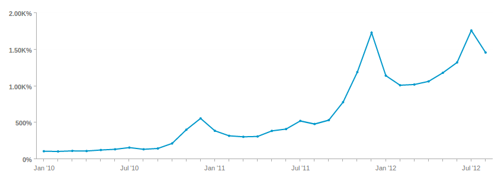

# [!DNL Visual Report Builder] verwenden

Mit dem [[!DNL Visual Report Builder]](../data-user/reports/ess-rpt-build-visual.md) können Sie Ihre Daten visuell untersuchen, um Erkenntnisse zu gewinnen und geschäftliche Entscheidungen zu fördern. Dieses Tutorial führt Sie durch den Prozess zum Erstellen eines Basisberichts.

>[!NOTE]
>
>Um einen Bericht zu einem Dashboard hinzuzufügen, benötigen Sie `Standard` [Benutzerberechtigungen](../administrator/user-management/user-management.md) und `Edit` Zugriff auf das Dashboard.

## Schritt 1: Erstellen eines Berichts

Um mit der Erstellung eines Berichts zu beginnen, klicken Sie in der Seitenleiste oder oben in einem beliebigen Dashboard auf **[!UICONTROL Report Builder]** **[!UICONTROL Add Report]** . Wenn die Seite `Report Builder` angezeigt wird, klicken Sie auf die Option **[!UICONTROL Visual Report Builder]** .

Um einen in der [!DNL Visual Report Builder] erstellten Bericht zu bearbeiten, klicken Sie auf das Zahnradsymbol (Optionen) oben rechts in einem beliebigen Diagramm und dann auf **[!UICONTROL Edit]**.

## Schritt 2: Hinzufügen von Metriken

Der erste Schritt bei der Erstellung einer Analyse besteht darin, [ zu analysierende ](../data-user/reports/ess-manage-data-metrics.md) auszuwählen. Während die Metriken standardmäßig alphabetisch aufgelistet sind, können Sie sie auch nach der Tabelle gruppieren, der die Metrik zugrunde liegt.

Nachdem die ursprüngliche Metrik ausgewählt wurde, können Sie zusätzliche Metriken hinzufügen und alle Metriken in einem Bericht überlagern oder Berechnungen mit mehreren Metriken durchführen, indem Sie Formeln hinzufügen.

## Schritt 3: `Formulas` hinzufügen

`Formulas` werden zu Berichten hinzugefügt, indem Sie auf **[!UICONTROL Add Formula]** klicken, die sich direkt über der Liste der Metriken im Bericht befindet. Im [Formeleditor](../data-analyst/dev-reports/formulas-in-rpt-bldr.md) kann jede der im Bericht enthaltenen Metriken als Eingabe verwendet werden. Zur Bearbeitung der verschiedenen Metriken werden grundlegende mathematische Operatoren verwendet.

Angenommen, Sie möchten einen Bericht erstellen, der den durchschnittlichen Umsatz pro Bestellung ausgibt. In diesem Fall würden Sie die `Revenue` Metrik durch die `Number of orders` Metrik teilen.

## Schritt 4: `Time Period` und `Interval of Analysis` einstellen {#time}

Sie können den Zeitraum für die Analyse auf Null in einer bestimmten Zeitspanne festlegen. Sie können auch Zeitintervalle zur Segmentierung der Daten auswählen (z. B. nach Jahr, Quartal oder Monat). Verwenden Sie die Menüs oben rechts im Diagramm, um den Zeitraum und das Intervall festzulegen.

Wenn Sie einen bestimmten Datumsbereich für den Zeitraum festlegen, stellen Sie sicher, dass das Startdatum am Anfang des Intervalls und das Enddatum am Ende Ihres Intervalls liegt.

Wenn Sie beispielsweise einen Zeitraum zwischen `January 1st` und `March 1st` festlegen und ein `monthly` auswählen, wird `March` als Datenpunkt angezeigt, aber jeden Tag in `March` außer `March 1` ignoriert. In diesem Fall sollten Sie Ihre `Time Period` von `January 1 to March 31` machen.

## Schritt 5: `Group by` / `Segmenting the Analysis` {#groupby}

[Um Ihre Metriken nach einer Datendimension zu ](../best-practices/segment-filter.md), klicken Sie oben links im Diagramm auf das Menü **[!UICONTROL Group by]** . Dadurch wird ein Dropdown-Menü angezeigt, das alle verfügbaren Dimensionen der ersten in der Liste enthaltenen Metrik enthält.

Sie können `None` auswählen, um zu verhindern, dass eine Metrik segmentiert wird. Beispielsweise könnten Sie eine Metrik benötigen, die den Gesamtumsatz ohne Segmentierung zurückgibt, während eine andere Umsatzmetrik nach Region segmentiert ist.

Gehen Sie zurück zu Ihrem Beispiel für den durchschnittlichen Umsatz pro Bestellung und legen Sie „Gruppieren nach“ auf „Promo-Code“ fest. Dies zeigt den durchschnittlichen Umsatz pro Bestellung für Bestellungen mit und ohne Promo-Code.

Wenn die in der Analyse enthaltenen Metriken auf verschiedenen Datentabellen basieren, können Sie in einem Popup die entsprechende Datendimension in jeder Tabelle auswählen. Das Ziel besteht hier darin, Dimensionen zu finden, die gemeinsame Werte für die Segmentierung aufweisen:

## Schritt 6: Festlegen von `Metric Filters`, `Perspective` und `Time Interval` {#metric-specific}

Für jede Metrik, die der Analyse hinzugefügt wird, können Sie Filter hinzufügen, die relevante Datenperspektive auswählen und `time interval` Optionen festlegen. Um auf diese Funktionen zuzugreifen, klicken Sie auf die Symbole Trichter (`Filter`), Auge (`Perspective`) und Uhr (`Time`) neben den im Bericht enthaltenen Metriken.

### `Filters`

`Filters` begrenzen den in der Analyse enthaltenen Datensatz. Filter sind beispielsweise nützlich, wenn es darum geht, einzelne Akquisekanäle zu bewerten und Ausreißer zu entfernen.

Zusätzlich zu den Dropdown-Menüs und dem Textfeld können Sie auch spezielle Filteroperatoren wie `LIKE` oder `IN` verwenden, um Filter zu erstellen.

Die Verwendung von Platzhaltern (`%` oder `_`) mit `LIKE` Anweisungen wird unterstützt. Der `%` Platzhalter entspricht mehreren Zeichen, während `_` nur einem einzigen Zeichen entspricht. Beispiel:

- `affiliate's name Like B%` erlaubt nur Daten von Kunden, deren Name mit `B` beginnt.

- `affiliate's name Like _ake` lassen nur Daten von Kunden zu, deren Namen etwa `Jake`, `Rake` oder `Bake` sind, nicht jedoch `Drake` oder `Blake`.

Das Hinzufügen mehrerer Filter ermöglicht eine strenge Kontrolle der Diagrammdaten. Standardmäßig müssen alle Filterbedingungen erfüllt sein, damit ein Datenelement eingeschlossen wird. Sie können jedoch ODER-Beziehungen erstellen, indem Sie das Textfeld Filterregeln bearbeiten.

### `Perspectives`

`Perspectives` Ermöglicht Ihnen das einfache Wechseln zwischen verschiedenen Ansichten Ihrer Daten. Sehen Sie sich an, was verfügbar ist:

- `Standard perspective`: Die Standardperspektive zeigt das Ergebnis für das Abgleichdatum auf der X-Achse an (z. B. Umsatz im Januar). Dies ist die Perspektive, die Sie im Beispiel für den durchschnittlichen Umsatz pro Bestellung verwenden.

- `Amount` ODER-`Percent Change` versus `Previous Period` Perspektive: Diese Perspektive zeigt die Menge oder prozentuale Änderung von einem Intervall zum nächsten und ist nützlich, um die Änderungsrate in sich schnell ändernden Metriken zu messen. Es gibt auch eine Perspektive, das Intervall mit dem gleichen Zeitraum des Vorjahres zu vergleichen, um ein jährliches Wachstum zu zeigen.

- `Cumulative perspective`: Die `cumulative perspective` zeigt den laufenden oder kumulativen Summenbetrag der Metrik über den Zeitraum an. Dies wird häufig verwendet, um Gesamtkunden zu analysieren und zukünftige Kapazitäten zu planen.

- `Percent of First Value perspective`: Diese Perspektive zeigt die Daten als Prozentsatz des ersten in die Analyse eingeschlossenen Intervalls an. Dies ist hilfreich, um die Effektivität bestimmter Aktionen im Verhältnis zur Leistung des ersten Zeitraums zu messen.

- `Rolling averages window perspective`: Die Fensterperspektive Rollierende Durchschnittswerte zeigt den rollierenden Durchschnittswert einer Metrik über den angegebenen Zeitraum an. Das Intervall muss dem auf Berichtsebene festgelegten Intervall entsprechen. Wenn der Bericht beispielsweise das letzte vollständige Quartal mit dem Umsatz nach Woche ausgibt, können Sie den rollierenden durchschnittlichen Zeitbereich des Fensters auf vier Wochen festlegen. Dadurch sind die ersten drei Werte null und der vierte Wert stellt den Durchschnitt der ersten vier Wochen des Umsatzes dar. Deaktivieren Sie aus Gründen der Klarheit das Kontrollkästchen `Multiple Y-Axes` , wenn Sie dieselbe Metrik mit einem rollierenden Durchschnitt anzeigen (siehe folgendes Beispiel).

### Metrikspezifische Zeitoptionen

Für Metriken, die in Berichten verwendet werden, gibt es zwei Optionen: Sie können sich im Zeitverlauf entsprechend den globalen Zeitoptionen entwickeln, oder nicht, wodurch sie als skalare Zahl angezeigt werden.

Wenn Sie ein Metrik-Zeitintervall in `None` ändern, wird eine `scalar` Zahl zurückgegeben. Dies ist nützlich, wenn Sie Formeln erstellen, bei denen eine Zeitverlaufsmetrik durch eine `scalar` Zahl geteilt wird. Außerdem können Sie auch den Zeitbereich der `scalar` Metrik in einen Zeitbereich ändern, der unabhängig von dem für den Bericht ist.

Beispiel: Sie wollten den monatlichen Umsatz für 2019 als Prozentsatz des Gesamtumsatzes für 2019 ausdrücken. Sie können einem Bericht mit einem globalen Zeitraum vom 1. Januar 2019 bis zum 31. Dezember 2019, segmentiert nach monatlichem Intervall, zwei `Revenue` Metriken hinzufügen.

>[!NOTE]
>
>Wenn Sie `group by` Dimensionen hinzufügen, wählen Sie eine neue Visualisierung aus oder passen Sie das Zeitintervall an und speichern Sie dann nur die Zahl (`scalar`). Diese Anpassungen werden nicht beibehalten, wenn Sie den Bericht das nächste Mal über ein Dashboard öffnen. Nur der Zeitraum wird beibehalten.

Weitere Informationen zur Verwendung von Zeitoptionen in Berichten finden Sie in diesem [Tutorial](../tutorials/time-options-visual-rpt-bldr.md).

## Schritt 7: Speichern des Berichts

Wenn Sie ein Diagramm erstellen, können Sie es speichern, indem Sie oben rechts im **[!UICONTROL Save]** auf `Visual Report Builder` klicken.

Sie können ein Diagramm, eine Tabelle oder eine Zahl (`scalar`) über das Dropdown-Menü `Type` und das Dashboard speichern, in dem der Bericht gespeichert werden soll, indem Sie das Dropdown-Menü `Location` verwenden.

Sie können den Bericht dann speichern, indem Sie auf **[!UICONTROL Save to Dashboard]** klicken.

## Berichtsausgaben

Informationen zur Auswahl der Berichtsausgabe finden Sie in den folgenden Themen:

### Diagramm

### Tabelle

### Zahl (`scalar`)

Herzlichen Glückwunsch! Sie sind fertig.
