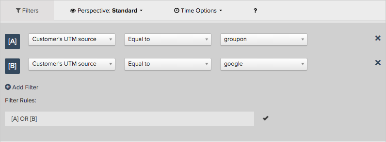

# Verwenden Sie den [!DNL Visual Report Builder]

Mit dem [[!DNL Visual Report Builder]](../data-user/reports/ess-rpt-build-visual.md) können Sie Ihre Daten visuell untersuchen, um Erkenntnisse zu gewinnen und Geschäftsentscheidungen zu fördern. Dieses Tutorial führt Sie durch den Prozess der Erstellung eines Basisberichts.

>[!NOTE]
>
>Um einem Dashboard einen Bericht hinzuzufügen, benötigen Sie `Standard` [Benutzerberechtigungen](../administrator/user-management/user-management.md) und `Edit` Zugriff auf das Dashboard.

## Schritt 1: Erstellen eines Berichts

Um mit der Erstellung eines Berichts zu beginnen, klicken Sie in der Seitenleiste auf **[!UICONTROL Report Builder]** oder oben im Dashboard auf **[!UICONTROL Add Report]** . Wenn die Seite `Report Builder` angezeigt wird, klicken Sie auf die Option **[!UICONTROL Visual Report Builder]** .

Um einen in [!DNL Visual Report Builder] erstellten Bericht zu bearbeiten, klicken Sie auf das Zahnradsymbol (Optionen) in der oberen rechten Ecke eines beliebigen Diagramms und dann auf **[!UICONTROL Edit]**.

## Schritt 2: Hinzufügen von Metriken

Der erste Schritt beim Erstellen einer Analyse besteht darin, [die zu analysierende Metrik](../data-user/reports/ess-manage-data-metrics.md) auszuwählen. Während die Metriken standardmäßig alphabetisch aufgelistet sind, können Sie sie auch nach der Tabelle gruppieren, auf der die Metrik basiert.

Sie können nach Auswahl der ursprünglichen Metrik zusätzliche Metriken hinzufügen und alle Metriken in einem einzelnen Bericht überlagern oder mehrere Metriken berechnen, indem Sie Formeln hinzufügen.

## Schritt 3: Hinzufügen von `Formulas`

`Formulas` werden zu Berichten hinzugefügt, indem Sie auf **[!UICONTROL Add Formula]** klicken, der sich direkt über der Liste der Metriken im Bericht befindet. Im [Formeleditor](../data-analyst/dev-reports/formulas-in-rpt-bldr.md) können alle im Bericht enthaltenen Metriken als Eingaben verwendet werden. Grundlegende mathematische Operatoren werden verwendet, um die verschiedenen Metriken zu bearbeiten.

Angenommen, Sie möchten einen Bericht erstellen, der uns den durchschnittlichen Umsatz pro Bestellung zeigt. In diesem Fall würden Sie die Metrik `Revenue` durch die Metrik `Number of orders` dividieren.

## Schritt 4: Festlegen von `Time Period` und `Interval of Analysis` {#time}

Wenn Sie einen bestimmten Zeitraum nicht einbeziehen möchten, können Sie den Zeitraum für die Analyse festlegen. Sie können auch Zeitintervalle auswählen, um die Daten zu segmentieren (z. B. nach Jahr, Quartal oder Monat). Verwenden Sie die Menüs in der oberen rechten Ecke des Diagramms, um den Zeitraum und das Intervall festzulegen.

Stellen Sie beim Festlegen eines bestimmten Datumsbereichs für den Zeitraum sicher, dass sich das Startdatum am Anfang des Intervalls befindet und das Enddatum am Ende Ihres Intervalls liegt.

Wenn Sie beispielsweise einen Zeitraum von `January 1st` auf `March 1st` festlegen und ein `monthly` -Intervall auswählen, wird `March` als Datenpunkt angezeigt, aber jeder Tag in `March` außer `March 1` wird ignoriert. In diesem Fall sollten Sie Ihre `Time Period` von `January 1 to March 31` nehmen.

## Schritt 5: `Group by` / `Segmenting the Analysis` {#groupby}

[Um Ihre Metriken nach einer Datendimension zu segmentieren](../best-practices/segment-filter.md), klicken Sie oben links im Diagramm auf das Menü **[!UICONTROL Group by]** . Dadurch wird eine Dropdown-Liste mit allen verfügbaren Dimensionen der ersten in der Liste enthaltenen Metrik angezeigt.

Sie können &quot;`None`&quot;auswählen, um die Segmentierung einer Metrik zu verhindern. So könnten Sie beispielsweise eine Metrik wünschen, die den Gesamtumsatz ohne Segmentierung zurückgibt, während eine andere Umsatzmetrik nach Region segmentiert ist.

Kehren Sie zu Ihrem Beispiel für den durchschnittlichen Umsatz pro Bestellung zurück und legen Sie die Gruppe auf den Angebotscode fest. Dies zeigt Ihnen den durchschnittlichen Umsatz pro Bestellung für Bestellungen mit und ohne Sonderangebotscode.

Wenn die in der Analyse enthaltenen Metriken auf unterschiedlichen Datentabellen basieren, können Sie in einem Popup-Fenster die passende Datendimension in jeder Tabelle auswählen. Das Ziel besteht hier darin, Dimensionen zu finden, die den Typ von Werten für die Segmentierung teilen:

## Schritt 6: Einstellen von `Metric Filters`, `Perspective` und `Time Interval` {#metric-specific}

Für jede zur Analyse hinzugefügte Metrik können Sie Filter hinzufügen, die relevante Datenperspektive auswählen und `time interval` -Optionen festlegen. Um auf diese Funktionen zuzugreifen, klicken Sie auf die Trichter- (`Filter`), Augensymbole (`Perspective`) und Uhrensymbole (`Time`) neben den im Bericht enthaltenen Metriken.

### `Filters`

`Filters` begrenzt den in der Analyse enthaltenen Datensatz. Filter sind beispielsweise beim Auswerten einzelner Akquisekanäle und beim Entfernen von Ausreißern nützlich.

Zusätzlich zu den Dropdown-Menüs und dem Textfeld können Sie auch spezielle Filteroperatoren wie `LIKE` oder `IN` verwenden, um Filter zu erstellen.

Die Verwendung von Platzhaltern (`%` oder `_`) mit `LIKE` -Anweisungen wird unterstützt. Der Platzhalter `%` entspricht mehreren Zeichen, während `_` nur mit einem einzelnen Zeichen übereinstimmt. Beispiel:

- `affiliate's name Like B%` erlaubt nur Daten von Kunden, deren Name mit `B` beginnt.

- `affiliate's name Like _ake` erlaubt nur Daten von Kunden, deren Namen etwa `Jake`, `Rake` oder `Bake`, aber nicht `Drake` oder `Blake` entsprechen.

Durch das Hinzufügen mehrerer Filter können die Daten der Grafik genau gesteuert werden. Standardmäßig müssen alle Filterbedingungen wahr sein, damit ein Datenelement eingeschlossen wird. Sie können jedoch ODER-Beziehungen erstellen, indem Sie das Textfeld Filterregeln bearbeiten.

### `Perspectives`

`Perspectives` Ermöglicht Ihnen den einfachen Umschalter zwischen verschiedenen Ansichten Ihrer Daten. Sehen Sie sich an, was verfügbar ist:

- `Standard perspective`: Die Standardperspektive zeigt Ihnen das Ergebnis für das entsprechende Datum auf der X-Achse (z. B. Umsatz im Januar). Dies ist die Perspektive, die Sie in Ihrem Beispiel Durchschnittlicher Umsatz pro Bestellung verwenden.

- Perspektive `Amount` ODER `Percent Change` versus `Previous Period`: Diese Perspektive zeigt die Menge oder prozentuale Änderung von einem Intervall zum nächsten und ist nützlich zur Messung der Änderungsrate bei schnell wechselnden Metriken. Es gibt auch eine Perspektive, um das Intervall mit dem gleichen Zeitraum im letzten Jahr zu vergleichen und das Wachstum im Jahresvergleich anzuzeigen.

- `Cumulative perspective`: Die `cumulative perspective` zeigt den laufenden oder kumulativen Summenbetrag der Metrik über den Zeitraum an. Dies wird häufig zur Analyse der Gesamtkunden und zur Planung künftiger Kapazitäten verwendet.

- `Percent of First Value perspective`: Diese Perspektive zeigt die Daten als Prozentsatz des in die Analyse einbezogenen Erstintervalls an. Dies ist hilfreich bei der Messung der Effektivität spezifischer Aktionen im Vergleich zur Leistung des ersten Zeitraums.

- `Rolling averages window perspective`: Die Perspektive des Fensters &quot;Rollierende Durchschnittswerte&quot;zeigt den rollierenden Durchschnittswert einer Metrik über den angegebenen Zeitraum. Das Intervall muss mit dem auf Berichtsebene festgelegten Intervall übereinstimmen. Wenn der Bericht beispielsweise das letzte vollständige Quartal des Umsatzes pro Woche anzeigt, können Sie den rollierenden durchschnittlichen Fensterzeitbereich auf vier Wochen festlegen. Dadurch sind die ersten drei Werte null und der vierte Wert stellt den Durchschnitt der ersten vier Umsatzwochen dar. Aus Gründen der Klarheit deaktivieren Sie das Kontrollkästchen `Multiple Y-Axes` , wenn Sie dieselbe Metrik mit einem rollierenden Durchschnitt anzeigen, wie im Beispiel unten.

### Metrikspezifische Zeitoptionen

Für Metriken, die in Berichten verwendet werden, gibt es zwei Optionen: Sie können einen Trend im Zeitverlauf entsprechend den globalen Zeitoptionen aufweisen oder nicht, wodurch sie als Skalarzahl angezeigt werden.

Wenn Sie ein Metrikzeitintervall auf `None` ändern, wird eine `scalar`-Zahl zurückgegeben. Dies ist nützlich bei der Erstellung von Formeln, die eine Metrik mit Trends in der Zeit durch eine `scalar`-Zahl teilen. Sie können auch den Zeitbereich der Metrik `scalar` in einen Zeitraum ändern, der unabhängig von dem für den Bericht ist.

Nehmen wir beispielsweise an, Sie wollten sehen, dass der monatliche Umsatz von 2019 in Prozent des Gesamtumsatzes von 2019 ausgedrückt wird. Sie können einem Bericht mit einem globalen Zeitbereich vom 1. Januar 2019 bis zum 31. Dezember 2019 zwei `Revenue` -Metriken hinzufügen, segmentiert nach monatlichem Intervall.

>[!NOTE]
>
>Wenn Sie `group by` -Dimensionen hinzufügen, wählen Sie eine neue Visualisierung oder passen Sie das Zeitintervall an und speichern Sie dann nur die Zahl (`scalar`). Diese Anpassungen werden nicht beibehalten, wenn Sie den Bericht das nächste Mal über ein Dashboard öffnen - es wird nur der Zeitraum beibehalten.

Weitere Informationen zur Verwendung von Zeitoptionen in Berichten finden Sie in diesem [Tutorial](../tutorials/time-options-visual-rpt-bldr.md).

## Schritt 7: Speichern des Berichts

Wenn Sie ein Diagramm erstellen, können Sie es speichern, indem Sie oben rechts im `Visual Report Builder` auf **[!UICONTROL Save]** klicken.

Sie können ein Diagramm, eine Tabelle oder eine Zahl (`scalar`) über das Dropdown-Menü `Type` und das Dashboard, in dem der Bericht gespeichert werden soll, über das Dropdown-Menü `Location` speichern.

Anschließend können Sie den Bericht speichern, indem Sie auf **[!UICONTROL Save to Dashboard]** klicken.

## Berichtsausgabe

Informationen zur Auswahl der Berichtausgabe finden Sie unter folgenden Themen:

### Diagramm

### Verzeichnis

### Zahl (`scalar`)

Herzlichen Glückwunsch! Du bist fertig.
